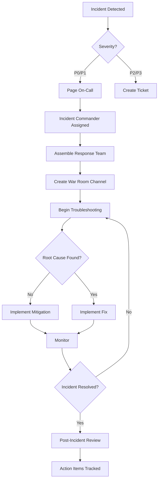
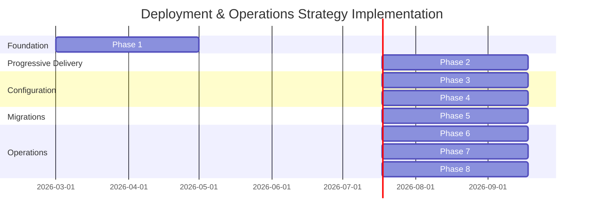

# ADR-018: Deployment & Operations Strategy

**Status**: Draft (Not Implemented)  
**Date**: 2026-02-01  
**Deciders**: Architecture Team, Platform Team, SRE Team  
**Tier**: Core  
**Tags**: deployment, operations, sre, resiliency, config-management  

## Context
SAP-grade ERP platforms define standardized deployment approaches, zero-downtime maintenance, configuration governance, and operational runbooks. This ADR defines the unified deployment and operations strategy for ChiroERP, including safe rollouts, maintenance practices, and operational runbooks.

## Decision
Adopt a **standardized deployment and operations strategy** with safe rollout patterns, configuration management, and incident response playbooks. Implementation is **not started**; this ADR defines the standard.

### Deployment Strategy

### Deployment Patterns Overview

| Pattern | Use Case | Downtime | Risk | Rollback Speed | Cost |
|---------|----------|----------|------|----------------|------|
| **Rolling** | Stateless services, low risk | Near-zero | Low | Fast (minutes) | Low |
| **Blue/Green** | Database migrations, major releases | Zero | Medium | Instant | High (2x resources) |
| **Canary** | Critical APIs, feature validation | Zero | Low | Fast (minutes) | Medium |
| **Recreate** | Dev/test only, batch jobs | Full | High | Slow (5-10 min) | Low |

### Rolling Deployment (Default)

```yaml
# kubernetes/deployment.yaml
apiVersion: apps/v1
kind: Deployment
metadata:
  name: financial-accounting-api
  namespace: chiroerp
  labels:
    app: financial-accounting-api
    version: v1.2.3
spec:
  replicas: 5
  
  strategy:
    type: RollingUpdate
    rollingUpdate:
      maxSurge: 2         # Add 2 new pods before removing old
      maxUnavailable: 1   # Max 1 pod down at a time
  
  minReadySeconds: 30     # Wait 30s before considering pod ready
  
  selector:
    matchLabels:
      app: financial-accounting-api
  
  template:
    metadata:
      labels:
        app: financial-accounting-api
        version: v1.2.3
      annotations:
        prometheus.io/scrape: "true"
        prometheus.io/port: "8080"
        prometheus.io/path: "/q/metrics"
    
    spec:
      # Graceful shutdown
      terminationGracePeriodSeconds: 60
      
      containers:
      - name: api
        image: chiroerp/financial-accounting-api:v1.2.3
        imagePullPolicy: IfNotPresent
        
        ports:
        - name: http
          containerPort: 8080
          protocol: TCP
        
        # Health checks
        livenessProbe:
          httpGet:
            path: /q/health/live
            port: 8080
          initialDelaySeconds: 60
          periodSeconds: 10
          timeoutSeconds: 5
          failureThreshold: 3
        
        readinessProbe:
          httpGet:
            path: /q/health/ready
            port: 8080
          initialDelaySeconds: 30
          periodSeconds: 5
          timeoutSeconds: 3
          failureThreshold: 3
        
        # Startup probe (for slow starting apps)
        startupProbe:
          httpGet:
            path: /q/health/started
            port: 8080
          initialDelaySeconds: 0
          periodSeconds: 5
          timeoutSeconds: 3
          failureThreshold: 30  # 30 * 5s = 150s max startup time
        
        # Resources
        resources:
          requests:
            memory: "1Gi"
            cpu: "500m"
          limits:
            memory: "2Gi"
            cpu: "2000m"
        
        # Environment variables
        env:
        - name: QUARKUS_PROFILE
          value: "production"
        - name: TENANT_ID
          valueFrom:
            fieldRef:
              fieldPath: metadata.annotations['tenant-id']
        
        # Secrets from Vault
        envFrom:
        - secretRef:
            name: financial-accounting-secrets
        
        # Config from ConfigMap
        volumeMounts:
        - name: config
          mountPath: /config
          readOnly: true
        
        # Graceful shutdown hook
        lifecycle:
          preStop:
            exec:
              command: ["/bin/sh", "-c", "sleep 15"]  # Allow load balancer to deregister
      
      volumes:
      - name: config
        configMap:
          name: financial-accounting-config
```

### Blue/Green Deployment

```yaml
# Blue/Green using ArgoCD Application
apiVersion: argoproj.io/v1alpha1
kind: Rollout
metadata:
  name: financial-accounting-api
  namespace: chiroerp
spec:
  replicas: 5
  
  strategy:
    blueGreen:
      # Active service
      activeService: financial-accounting-api
      # Preview service for testing
      previewService: financial-accounting-api-preview
      
      # Auto-promotion after 5 minutes if no issues
      autoPromotionEnabled: true
      autoPromotionSeconds: 300
      
      # Scale down old version after promotion
      scaleDownDelaySeconds: 300
      scaleDownDelayRevisionLimit: 1
  
  selector:
    matchLabels:
      app: financial-accounting-api
  
  template:
    metadata:
      labels:
        app: financial-accounting-api
    spec:
      containers:
      - name: api
        image: chiroerp/financial-accounting-api:v1.2.3
        # ... same as rolling deployment
```

```yaml
# Active Service
apiVersion: v1
kind: Service
metadata:
  name: financial-accounting-api
  namespace: chiroerp
spec:
  selector:
    app: financial-accounting-api
  ports:
  - name: http
    port: 80
    targetPort: 8080
  type: ClusterIP

# Preview Service (for testing before promotion)
apiVersion: v1
kind: Service
metadata:
  name: financial-accounting-api-preview
  namespace: chiroerp
spec:
  selector:
    app: financial-accounting-api
  ports:
  - name: http
    port: 80
    targetPort: 8080
  type: ClusterIP
```

### Canary Deployment

```yaml
# Canary using Argo Rollouts
apiVersion: argoproj.io/v1alpha1
kind: Rollout
metadata:
  name: financial-accounting-api
  namespace: chiroerp
spec:
  replicas: 10
  
  strategy:
    canary:
      # Canary steps
      steps:
      - setWeight: 10      # Route 10% traffic to canary
      - pause: {duration: 5m}  # Monitor for 5 minutes
      
      - setWeight: 25      # Increase to 25%
      - pause: {duration: 5m}
      
      - setWeight: 50      # Increase to 50%
      - pause: {duration: 10m}
      
      - setWeight: 75      # Increase to 75%
      - pause: {duration: 5m}
      
      # If all steps pass, promote to 100%
      
      # Canary service for monitoring
      canaryService: financial-accounting-api-canary
      stableService: financial-accounting-api
      
      # Traffic routing (using Istio/Nginx)
      trafficRouting:
        istio:
          virtualService:
            name: financial-accounting-api
      
      # Analysis during canary
      analysis:
        templates:
        - templateName: success-rate
        - templateName: latency-p95
        args:
        - name: service
          value: financial-accounting-api
  
  selector:
    matchLabels:
      app: financial-accounting-api
  
  template:
    # ... same as rolling deployment
```

```yaml
# AnalysisTemplate for success rate
apiVersion: argoproj.io/v1alpha1
kind: AnalysisTemplate
metadata:
  name: success-rate
  namespace: chiroerp
spec:
  args:
  - name: service
  metrics:
  - name: success-rate
    initialDelay: 1m
    interval: 1m
    successCondition: result >= 0.95  # 95% success rate required
    failureLimit: 3
    provider:
      prometheus:
        address: http://prometheus:9090
        query: |
          sum(rate(http_requests_total{service="{{args.service}}",status!~"5.."}[5m])) /
          sum(rate(http_requests_total{service="{{args.service}}"}[5m]))

# AnalysisTemplate for latency
apiVersion: argoproj.io/v1alpha1
kind: AnalysisTemplate
metadata:
  name: latency-p95
  namespace: chiroerp
spec:
  args:
  - name: service
  metrics:
  - name: latency-p95
    initialDelay: 1m
    interval: 1m
    successCondition: result <= 0.3  # p95 <= 300ms
    failureLimit: 3
    provider:
      prometheus:
        address: http://prometheus:9090
        query: |
          histogram_quantile(0.95, 
            sum(rate(http_request_duration_bucket{service="{{args.service}}"}[5m])) by (le)
          )
```

### Deployment Checklist

```markdown
# Pre-Deployment Checklist

### Code & Build

- [ ] Code reviewed and approved
- [ ] All tests passing (unit, integration, E2E)
- [ ] Performance tests passed (no regression)
- [ ] Security scan completed (no critical vulnerabilities)
- [ ] Container image built and tagged
- [ ] Image pushed to registry
- [ ] Changelog updated

### Database

- [ ] Schema migrations tested in staging
- [ ] Migration is backward-compatible
- [ ] Rollback plan documented
- [ ] Data backup completed
- [ ] Migration estimated duration < 5 minutes

### Configuration

- [ ] Environment-specific configs updated
- [ ] Feature flags configured
- [ ] Secrets rotated if needed
- [ ] Config validation passed

### Observability

- [ ] Health checks verified
- [ ] Metrics endpoints exposed
- [ ] Logging configured
- [ ] Alerts updated for new version
- [ ] Dashboards updated

### Communication

- [ ] Change request approved
- [ ] Stakeholders notified
- [ ] Maintenance window scheduled (if needed)
- [ ] Rollback plan communicated

### Post-Deployment

- [ ] Smoke tests passed
- [ ] Metrics reviewed (latency, error rate)
- [ ] Logs checked for errors
- [ ] User acceptance testing (if applicable)
- [ ] Incident report filed (if issues)
```

### Zero-Downtime Database Migrations

### Migration Strategy

| Pattern | Use Case | Complexity | Risk |
|---------|----------|------------|------|
| **Expand-Contract** | Column additions/removals | Medium | Low |
| **Dual Writes** | Schema refactoring | High | Medium |
| **Shadow Writes** | Major data model changes | Very High | High |
| **Parallel Run** | System replacements | Very High | Low |

### Flyway Migration Example

```kotlin
// src/main/resources/db/migration/V1.2.3__add_customer_credit_limit.sql

-- Step 1: Add new column (nullable initially for backward compatibility)
ALTER TABLE ar.customers 
ADD COLUMN credit_limit DECIMAL(19,4) NULL;

-- Step 2: Backfill existing data with default value
UPDATE ar.customers 
SET credit_limit = 10000.00 
WHERE credit_limit IS NULL;

-- Step 3: Add index for query performance
CREATE INDEX idx_customers_credit_limit 
ON ar.customers(tenant_id, credit_limit) 
WHERE credit_limit IS NOT NULL;

-- Step 4: Add comment for documentation
COMMENT ON COLUMN ar.customers.credit_limit IS 
'Maximum credit allowed for customer. Default 10000.00. Added in v1.2.3';
```

```kotlin
// Flyway configuration in Quarkus
// application.yml
quarkus:
  flyway:
    migrate-at-start: true
    baseline-on-migrate: true
    baseline-version: 1.0.0
    locations: classpath:db/migration
    schemas: financial,ar,ap,inventory
    placeholders:
      tenant_id: SYSTEM
    validate-on-migrate: true
    out-of-order: false
    
    # Connection pool for migrations
    flyway-datasource:
      jdbc-url: ${DATABASE_URL}
      username: ${DB_MIGRATION_USER}
      password: ${DB_MIGRATION_PASSWORD}
```

### Expand-Contract Pattern (Multi-Phase Migration)

```sql
-- Phase 1: EXPAND (Deploy v1.2.0)
-- Add new column alongside old column
ALTER TABLE ar.invoices 
ADD COLUMN customer_id_v2 UUID NULL;

-- Create dual-write trigger to keep columns in sync
CREATE OR REPLACE FUNCTION sync_customer_id() 
RETURNS TRIGGER AS $$
BEGIN
  IF NEW.customer_id IS NOT NULL THEN
    NEW.customer_id_v2 := (SELECT customer_key FROM ar.customers WHERE legacy_id = NEW.customer_id);
  END IF;
  IF NEW.customer_id_v2 IS NOT NULL THEN
    NEW.customer_id := (SELECT legacy_id FROM ar.customers WHERE customer_key = NEW.customer_id_v2);
  END IF;
  RETURN NEW;
END;
$$ LANGUAGE plpgsql;

CREATE TRIGGER trg_sync_customer_id
BEFORE INSERT OR UPDATE ON ar.invoices
FOR EACH ROW EXECUTE FUNCTION sync_customer_id();

-- Backfill existing data (in batches to avoid locks)
DO $$
DECLARE
  batch_size INT := 10000;
  offset_val INT := 0;
BEGIN
  LOOP
    UPDATE ar.invoices i
    SET customer_id_v2 = c.customer_key
    FROM ar.customers c
    WHERE i.customer_id = c.legacy_id
      AND i.customer_id_v2 IS NULL
      AND i.invoice_id IN (
        SELECT invoice_id 
        FROM ar.invoices 
        WHERE customer_id_v2 IS NULL
        LIMIT batch_size OFFSET offset_val
      );
    
    EXIT WHEN NOT FOUND;
    offset_val := offset_val + batch_size;
    COMMIT;  -- Commit each batch
    PERFORM pg_sleep(0.1);  -- Throttle to avoid impacting production
  END LOOP;
END $$;

-- Phase 2: Wait 2-4 weeks, monitor, verify data consistency

-- Phase 3: CONTRACT (Deploy v1.3.0)
-- Make new column NOT NULL
ALTER TABLE ar.invoices 
ALTER COLUMN customer_id_v2 SET NOT NULL;

-- Drop old column
ALTER TABLE ar.invoices 
DROP COLUMN customer_id;

-- Rename new column
ALTER TABLE ar.invoices 
RENAME COLUMN customer_id_v2 TO customer_id;

-- Drop trigger (no longer needed)
DROP TRIGGER IF EXISTS trg_sync_customer_id ON ar.invoices;
DROP FUNCTION IF EXISTS sync_customer_id();
```

### Database Migration Monitoring

```kotlin
@ApplicationScoped
class MigrationMonitor(
    private val flyway: Flyway,
    private val meterRegistry: MeterRegistry
) {
    
    @PostConstruct
    fun registerMetrics() {
        Gauge.builder("flyway.migrations.pending") { getPendingMigrations() }
            .register(meterRegistry)
        
        Gauge.builder("flyway.migrations.applied") { getAppliedMigrations() }
            .register(meterRegistry)
    }
    
    fun getPendingMigrations(): Int {
        return flyway.info().pending().size
    }
    
    fun getAppliedMigrations(): Int {
        return flyway.info().applied().size
    }
    
    fun validateMigrations(): MigrationReport {
        val info = flyway.info()
        val failed = info.all().filter { it.state.isFailed }
        val pending = info.pending()
        
        return MigrationReport(
            totalApplied = info.applied().size,
            totalPending = pending.size,
            totalFailed = failed.size,
            failedMigrations = failed.map { it.description },
            status = when {
                failed.isNotEmpty() -> MigrationStatus.FAILED
                pending.isNotEmpty() -> MigrationStatus.PENDING
                else -> MigrationStatus.UP_TO_DATE
            }
        )
    }
}

data class MigrationReport(
    val totalApplied: Int,
    val totalPending: Int,
    val totalFailed: Int,
    val failedMigrations: List<String>,
    val status: MigrationStatus
)

enum class MigrationStatus {
    UP_TO_DATE,
    PENDING,
    FAILED
}
```

### Configuration Management

### Spring Cloud Config Server

```yaml
# config-server/application.yml
server:
  port: 8888

spring:
  cloud:
    config:
      server:
        git:
          uri: https://github.com/chiroerp/config-repo
          default-label: main
          search-paths: '{application}/{profile}'
          clone-on-start: true
          
        # Encryption for sensitive values
        encrypt:
          enabled: true
        
        # Composite configuration (git + vault)
        composite:
        - type: git
          uri: https://github.com/chiroerp/config-repo
        - type: vault
          host: vault.internal
          port: 8200
          scheme: https
          backend: secret
          profile-separator: /

management:
  endpoints:
    web:
      exposure:
        include: health,info,refresh,bus-refresh
```

### Client Configuration

```yaml
# financial-accounting-api/bootstrap.yml
spring:
  application:
    name: financial-accounting-api
  
  cloud:
    config:
      uri: http://config-server:8888
      profile: ${ENVIRONMENT:production}
      label: ${CONFIG_BRANCH:main}
      fail-fast: true
      retry:
        max-attempts: 6
        initial-interval: 1000
        multiplier: 1.1
        max-interval: 2000
      
      # Enable config refresh via /actuator/refresh
      enabled: true
```

### Configuration Structure

```
config-repo/
├── financial-accounting-api/
│   ├── production.yml          # Production overrides
│   ├── staging.yml             # Staging overrides
│   ├── development.yml         # Development overrides
│   └── default.yml             # Baseline config
├── ar-api/
│   ├── production.yml
│   └── default.yml
└── shared/
    ├── database.yml            # Shared DB config
    ├── kafka.yml               # Shared Kafka config
    └── observability.yml       # Shared metrics/tracing
```

### Configuration Example

```yaml
# config-repo/financial-accounting-api/production.yml

server:
  port: 8080
  shutdown: graceful

# Database
datasource:
  jdbc-url: ${DATABASE_URL}
  username: ${DATABASE_USER}
  password: ${DATABASE_PASSWORD}
  maximum-pool-size: 20
  minimum-idle: 10
  connection-timeout: 5000

# Kafka
kafka:
  bootstrap-servers: ${KAFKA_BROKERS}
  consumer:
    group-id: financial-accounting-consumer-group
    auto-offset-reset: earliest
  producer:
    acks: all
    retries: 3

# Feature flags
features:
  new-journal-entry-validation: true
  async-posting: false
  multi-currency-support: true

# Rate limiting
rate-limit:
  journal-entry-post: 100  # requests per minute per tenant
  query-api: 500

# Tenant-specific overrides (can be in Vault)
tenants:
  TENANT-001:
    features:
      async-posting: true
  TENANT-ENTERPRISE:
    features:
      async-posting: true
      multi-currency-support: true
```

### Dynamic Configuration Refresh

```kotlin
@Component
@RefreshScope  // Enables configuration refresh without restart
class FeatureFlags(
    @Value("\${features.new-journal-entry-validation:false}")
    var newJournalEntryValidation: Boolean,
    
    @Value("\${features.async-posting:false}")
    var asyncPosting: Boolean,
    
    @Value("\${features.multi-currency-support:false}")
    var multiCurrencySupport: Boolean
) {
    fun isEnabled(feature: String): Boolean {
        return when (feature) {
            "new-journal-entry-validation" -> newJournalEntryValidation
            "async-posting" -> asyncPosting
            "multi-currency-support" -> multiCurrencySupport
            else -> false
        }
    }
}

// Trigger refresh via HTTP POST to /actuator/refresh
// Or use Spring Cloud Bus for cluster-wide refresh
```

### Secrets Management

### HashiCorp Vault Integration

```yaml
# vault/policies/financial-accounting-api.hcl
path "secret/data/financial-accounting-api/*" {
  capabilities = ["read"]
}

path "database/creds/financial-accounting-rw" {
  capabilities = ["read"]
}

path "pki/issue/chiroerp-internal" {
  capabilities = ["create", "update"]
}
```

```kotlin
// Vault configuration in Quarkus
// application.yml
quarkus:
  vault:
    url: https://vault.internal:8200
    authentication:
      kubernetes:
        role: financial-accounting-api
    
    secret:
      config-prefixes:
        - secret/financial-accounting-api
        - secret/shared
    
    # Dynamic database credentials
    credentials-provider:
      database:
        credentials-role: financial-accounting-rw
        credentials-mount: database

// Using Vault secrets in code
@ApplicationScoped
class DatabaseConfig(
    @ConfigProperty(name = "database.username")
    val username: String,  // Injected from Vault
    
    @ConfigProperty(name = "database.password")
    val password: String   // Injected from Vault
)
```

### Kubernetes Secrets (for non-sensitive config)

```yaml
# kubernetes/secrets/financial-accounting-secrets.yaml
apiVersion: v1
kind: Secret
metadata:
  name: financial-accounting-secrets
  namespace: chiroerp
type: Opaque
stringData:
  DATABASE_USER: "financial_app_user"
  KAFKA_SASL_JAAS_CONFIG: "org.apache.kafka.common.security.plain.PlainLoginModule required username='app' password='changeme';"

# External Secrets Operator (syncs from Vault)
apiVersion: external-secrets.io/v1beta1
kind: ExternalSecret
metadata:
  name: financial-accounting-vault-secrets
  namespace: chiroerp
spec:
  refreshInterval: 1h
  secretStoreRef:
    name: vault-backend
    kind: SecretStore
  
  target:
    name: financial-accounting-secrets
    creationPolicy: Owner
  
  data:
  - secretKey: database-password
    remoteRef:
      key: secret/financial-accounting-api/database
      property: password
  
  - secretKey: jwt-signing-key
    remoteRef:
      key: secret/financial-accounting-api/jwt
      property: signing-key
```

### Secret Rotation

```kotlin
@ApplicationScoped
class SecretRotationService(
    private val vaultClient: VaultClient,
    private val dataSource: DataSource
) {
    
    @Scheduled(every = "24h")
    fun rotateDbCredentials() {
        logger.info("Starting database credential rotation")
        
        try {
            // 1. Request new credentials from Vault
            val newCreds = vaultClient.getDatabaseCredentials(
                role = "financial-accounting-rw"
            )
            
            // 2. Test new credentials
            testConnection(newCreds)
            
            // 3. Update datasource configuration
            updateDataSource(newCreds)
            
            // 4. Revoke old credentials (after grace period)
            scheduleRevocation(oldLease = currentLease, delayMinutes = 60)
            
            logger.info("Database credential rotation completed successfully")
            
        } catch (e: Exception) {
            logger.error("Failed to rotate database credentials", e)
            alerting.sendAlert("SECRET_ROTATION_FAILED", e.message)
        }
    }
}
```

### Incident Response & Runbooks

### Incident Severity Levels

| Severity | Definition | Response Time | Notification | Examples |
|----------|-----------|---------------|--------------|----------|
| **P0 - Critical** | Complete outage, data loss | < 15 minutes | Page on-call + escalate | API down, database corruption |
| **P1 - High** | Major degradation, partial outage | < 30 minutes | Page on-call | High latency, 50% error rate |
| **P2 - Medium** | Minor degradation, single tenant | < 2 hours | Slack alert | Slow reports, single service issue |
| **P3 - Low** | Cosmetic, workaround available | < 24 hours | Ticket | UI glitch, minor logging errors |

### Incident Response Process



### Runbook Template

````markdown
# Runbook: [Incident Type]

### Overview

**Symptoms**: What users/systems experience
**Impact**: Business impact and affected services
**Severity**: P0/P1/P2/P3

### Triage Steps

1. Check monitoring dashboards: [link]
2. Verify alerts in PagerDuty
3. Check recent deployments
4. Review recent config changes

### Diagnostic Queries

### Check API Error Rate
```promql
100 * (
  rate(http_errors_total{service="financial-accounting-api"}[5m]) /
  rate(http_requests_total{service="financial-accounting-api"}[5m])
)
```

### Check Database Connections
```sql
SELECT count(*), state 
FROM pg_stat_activity 
WHERE datname = 'financial' 
GROUP BY state;
```

### Check Kafka Consumer Lag
```bash
kafka-consumer-groups --bootstrap-server kafka:9092 \
  --group financial-accounting-consumer-group \
  --describe
```

### Common Causes

1. **Cause A**: Description and likelihood
2. **Cause B**: Description and likelihood
3. **Cause C**: Description and likelihood

### Resolution Steps

### Scenario 1: Database Connection Pool Exhausted
1. Verify connection pool metrics in Grafana
2. Check for long-running queries:
   ```sql
   SELECT pid, now() - query_start as duration, query 
   FROM pg_stat_activity 
   WHERE state = 'active' 
   ORDER BY duration DESC;
   ```
3. Kill blocking queries if necessary:
   ```sql
   SELECT pg_terminate_backend(pid) 
   FROM pg_stat_activity 
   WHERE pid = <pid>;
   ```
4. Increase connection pool size temporarily:
   ```bash
   kubectl set env deployment/financial-accounting-api \
     QUARKUS_DATASOURCE_JDBC_MAX_SIZE=50
   ```
5. Monitor for recovery

### Scenario 2: Kafka Consumer Lag High
1. Check consumer health
2. Verify broker availability
3. Scale consumer replicas:
   ```bash
   kubectl scale deployment/financial-event-consumer --replicas=10
   ```
4. Monitor lag reduction

### Rollback Procedure

1. Identify last known good version
2. Execute rollback:
   ```bash
   kubectl rollout undo deployment/financial-accounting-api
   ```
3. Verify rollback success
4. Monitor metrics

### Escalation Path

- **Primary On-Call**: @sre-oncall
- **Secondary On-Call**: @platform-lead
- **Engineering Manager**: @eng-manager
- **CTO**: @cto (P0 only)

### Post-Incident Actions

- [ ] Create incident report
- [ ] Schedule post-mortem (within 48 hours)
- [ ] Document root cause
- [ ] Create action items in Jira
- [ ] Update runbook if gaps found
- [ ] Communicate resolution to stakeholders
````

### Runbook: API Service Down (P0)

```markdown
# Runbook: API Service Down

### Symptoms

- All API requests returning 503/504
- Health check endpoints failing
- Zero successful requests in last 5 minutes

### Triage (< 5 minutes)

1. **Check Kubernetes pods**:
   ```bash
   kubectl get pods -n chiroerp -l app=financial-accounting-api
   kubectl describe pod -n chiroerp <pod-name>
   kubectl logs -n chiroerp <pod-name> --tail=100
   ```

2. **Check recent deployments**:
   ```bash
   kubectl rollout history deployment/financial-accounting-api -n chiroerp
   ```

3. **Check monitoring**:
   - Grafana: Service Overview Dashboard
   - Prometheus: Check for fired alerts
   - Logs: Elasticsearch/Kibana for error spikes

### Common Causes & Solutions

### Cause 1: OOMKilled Pods (80% of incidents)
**Detection**:
```bash
kubectl get pods -n chiroerp -l app=financial-accounting-api -o jsonpath='{.items[*].status.containerStatuses[*].lastState.terminated.reason}'
```

**Solution**:
```bash
# Increase memory limit
kubectl set resources deployment/financial-accounting-api \
  --limits=memory=4Gi -n chiroerp

# Monitor recovery
kubectl get pods -n chiroerp -l app=financial-accounting-api -w
```

### Cause 2: Failed Health Checks
**Detection**:
```bash
# Check readiness/liveness failures
kubectl describe pod <pod-name> -n chiroerp | grep -A 10 "Liveness\|Readiness"
```

**Solution**:
```bash
# Restart pods
kubectl rollout restart deployment/financial-accounting-api -n chiroerp

# If persistent, rollback
kubectl rollout undo deployment/financial-accounting-api -n chiroerp
```

### Cause 3: Database Connection Failure
**Detection**:
```bash
# Check database from pod
kubectl exec -it <pod-name> -n chiroerp -- sh
psql -h db-host -U user -d financial -c "SELECT 1"
```

**Solution**:
```bash
# Check database status
kubectl get pods -n database -l app=postgresql

# Restart database connections (if DB is up)
kubectl delete pods -n chiroerp -l app=financial-accounting-api
```

### Cause 4: Kafka Broker Unavailable
**Detection**:
```bash
# Check Kafka broker status
kubectl get pods -n kafka -l app=kafka

# Test connectivity from pod
kubectl exec -it <pod-name> -n chiroerp -- sh
nc -zv kafka-broker 9092
```

**Solution**:
```bash
# Restart Kafka consumers
kubectl rollout restart deployment/financial-event-consumer -n chiroerp
```

### Immediate Mitigation (< 15 minutes)

If root cause unclear, implement quick wins:

1. **Scale up replicas**:
   ```bash
   kubectl scale deployment/financial-accounting-api --replicas=10 -n chiroerp
   ```

2. **Rollback to last known good version**:
   ```bash
   kubectl rollout undo deployment/financial-accounting-api -n chiroerp
   ```

3. **Enable circuit breaker** (if implemented):
   ```bash
   # Update feature flag to disable problematic feature
   curl -X POST http://config-server/actuator/refresh
   ```

### Communication Template

**Slack #incidents**:
```
🚨 INCIDENT: Financial Accounting API Down (P0)
• Impact: All API requests failing
• Started: 2026-02-01 14:32 UTC
• Affected: All tenants
• IC: @john-doe
• War Room: #incident-2026-02-01-001
• Status: Investigating
```

**Update every 15 minutes**:
```
📊 UPDATE: Financial Accounting API Down
• Root cause: OOMKilled pods due to memory leak
• Action: Increased memory limits, restarting pods
• ETA: 10 minutes
• Next update: 15:15 UTC
```

**Resolution**:
```
✅ RESOLVED: Financial Accounting API Down
• Duration: 28 minutes
• Root cause: Memory leak in v1.2.3
• Resolution: Rolled back to v1.2.2, increased memory limits
• Post-mortem: Scheduled for Feb 2 @ 10am
```
```

### Runbook: High Database Latency (P1)

```markdown
# Runbook: High Database Latency

### Symptoms

- API p95 latency > 500ms (normally < 300ms)
- Database queries taking > 100ms
- Increased timeout errors

### Diagnostic Queries

### Check Slow Queries
```sql
-- PostgreSQL slow query log
SELECT 
  pid,
  now() - query_start AS duration,
  query,
  state
FROM pg_stat_activity
WHERE state = 'active'
  AND now() - query_start > interval '1 second'
ORDER BY duration DESC
LIMIT 10;
```

### Check Blocking Locks
```sql
SELECT 
  blocked_locks.pid AS blocked_pid,
  blocked_activity.usename AS blocked_user,
  blocking_locks.pid AS blocking_pid,
  blocking_activity.usename AS blocking_user,
  blocked_activity.query AS blocked_statement,
  blocking_activity.query AS blocking_statement
FROM pg_catalog.pg_locks blocked_locks
JOIN pg_catalog.pg_stat_activity blocked_activity ON blocked_activity.pid = blocked_locks.pid
JOIN pg_catalog.pg_locks blocking_locks ON blocking_locks.locktype = blocked_locks.locktype
JOIN pg_catalog.pg_stat_activity blocking_activity ON blocking_activity.pid = blocking_locks.pid
WHERE NOT blocked_locks.granted;
```

### Check Connection Pool Status
```bash
# From Grafana or direct query
kubectl exec -it <api-pod> -n chiroerp -- curl localhost:8080/q/metrics | grep datasource_connections
```

### Check Table Bloat
```sql
SELECT 
  schemaname,
  tablename,
  pg_size_pretty(pg_total_relation_size(schemaname||'.'||tablename)) AS size,
  pg_size_pretty(pg_total_relation_size(schemaname||'.'||tablename) - pg_relation_size(schemaname||'.'||tablename)) AS bloat
FROM pg_tables
WHERE schemaname NOT IN ('pg_catalog', 'information_schema')
ORDER BY pg_total_relation_size(schemaname||'.'||tablename) DESC
LIMIT 20;
```

### Resolution Steps

### 1. Kill Long-Running Queries
```sql
-- Terminate specific query
SELECT pg_terminate_backend(<pid>);

-- Terminate all idle queries > 10 minutes
SELECT pg_terminate_backend(pid)
FROM pg_stat_activity
WHERE state = 'idle'
  AND now() - state_change > interval '10 minutes';
```

### 2. Add Missing Indexes
```sql
-- Check missing indexes
SELECT 
  schemaname,
  tablename,
  seq_scan,
  seq_tup_read,
  idx_scan,
  seq_tup_read / seq_scan AS avg_rows_per_seq_scan
FROM pg_stat_user_tables
WHERE seq_scan > 100
  AND seq_tup_read / seq_scan > 1000
ORDER BY seq_tup_read DESC
LIMIT 10;

-- Create index (example)
CREATE INDEX CONCURRENTLY idx_invoices_tenant_date 
ON ar.invoices(tenant_id, invoice_date);
```

### 3. Vacuum and Analyze
```sql
-- Analyze specific table
ANALYZE ar.invoices;

-- Vacuum table (reclaim space)
VACUUM ANALYZE ar.invoices;

-- Vacuum full (requires exclusive lock, use off-hours)
VACUUM FULL ar.invoices;
```

### 4. Scale Database Resources
```bash
# Increase database instance size (AWS RDS example)
aws rds modify-db-instance \
  --db-instance-identifier chiroerp-prod \
  --db-instance-class db.r6g.2xlarge \
  --apply-immediately
```

### 5. Enable Read Replicas
```bash
# Route read queries to replicas
kubectl set env deployment/financial-accounting-api \
  DATABASE_READ_URL=jdbc:postgresql://db-replica:5432/financial
```
```

### On-Call Rotation Configuration

```yaml
# pagerduty/schedules.yaml
schedules:
  - name: SRE Primary On-Call
    type: weekly
    rotation_type: daily
    start_time: "09:00"
    timezone: "America/New_York"
    users:
      - alice@chiroerp.com
      - bob@chiroerp.com
      - carol@chiroerp.com
    
  - name: SRE Secondary On-Call
    type: weekly
    rotation_type: weekly
    start_time: "09:00"
    timezone: "America/New_York"
    users:
      - dave@chiroerp.com
      - eve@chiroerp.com

escalation_policies:
  - name: P0 Critical
    num_loops: 3
    escalation_rules:
      - escalation_delay_in_minutes: 0
        targets:
          - type: schedule_reference
            id: SRE Primary On-Call
      
      - escalation_delay_in_minutes: 15
        targets:
          - type: schedule_reference
            id: SRE Secondary On-Call
      
      - escalation_delay_in_minutes: 30
        targets:
          - type: user_reference
            id: engineering-manager
      
      - escalation_delay_in_minutes: 60
        targets:
          - type: user_reference
            id: cto
```

### Disaster Recovery

### Recovery Objectives by Service Tier

| Service Tier | RTO (Recovery Time) | RPO (Recovery Point) | Strategy | Cost |
|--------------|---------------------|----------------------|----------|------|
| **Critical** (API, Auth) | 15 minutes | 5 minutes | Multi-region active-active | High |
| **High** (Reports, Analytics) | 1 hour | 15 minutes | Multi-region active-passive | Medium |
| **Medium** (Batch Jobs) | 4 hours | 1 hour | Backup + restore | Low |
| **Low** (Internal Tools) | 24 hours | 24 hours | Backup only | Very Low |

### Multi-Region Architecture

```yaml
# Primary Region: us-east-1
# Secondary Region: eu-west-1
# Database: PostgreSQL with streaming replication
# Kafka: Multi-datacenter replication
# Object Storage: S3 cross-region replication

regions:
  primary:
    name: us-east-1
    services:
      - financial-accounting-api (active)
      - ar-api (active)
      - ap-api (active)
    database:
      role: primary
      replication: synchronous to eu-west-1
    traffic_weight: 80%
  
  secondary:
    name: eu-west-1
    services:
      - financial-accounting-api (standby)
      - ar-api (standby)
      - ap-api (standby)
    database:
      role: standby
      lag: < 1 second
    traffic_weight: 20%

failover:
  type: dns-based
  provider: Route53
  health_check_interval: 10s
  failover_time: < 2 minutes
```

### Automated Failover Configuration

```yaml
# Route53 health check and failover
apiVersion: route53.aws/v1alpha1
kind: HealthCheck
metadata:
  name: financial-api-primary
spec:
  type: HTTPS
  resourcePath: /q/health
  fqdn: api.us-east-1.chiroerp.com
  port: 443
  requestInterval: 10
  failureThreshold: 3

apiVersion: route53.aws/v1alpha1
kind: RecordSet
metadata:
  name: financial-api
spec:
  name: api.chiroerp.com
  type: A
  setIdentifier: primary-us-east-1
  failover: PRIMARY
  aliasTarget:
    hostedZoneId: Z1234567890ABC
    dnsName: alb.us-east-1.amazonaws.com
  healthCheckId: financial-api-primary

apiVersion: route53.aws/v1alpha1
kind: RecordSet
metadata:
  name: financial-api-failover
spec:
  name: api.chiroerp.com
  type: A
  setIdentifier: secondary-eu-west-1
  failover: SECONDARY
  aliasTarget:
    hostedZoneId: Z0987654321XYZ
    dnsName: alb.eu-west-1.amazonaws.com
```

### Database Replication Setup

```sql
-- PostgreSQL streaming replication configuration

-- Primary (us-east-1)
-- postgresql.conf
wal_level = replica
max_wal_senders = 10
max_replication_slots = 10
synchronous_commit = remote_write
synchronous_standby_names = 'standby_eu_west_1'

-- pg_hba.conf
host replication replicator 10.0.0.0/8 md5

-- Create replication slot
SELECT * FROM pg_create_physical_replication_slot('standby_eu_west_1');

-- Standby (eu-west-1)
-- recovery.conf (or recovery.signal in PostgreSQL 12+)
standby_mode = on
primary_conninfo = 'host=primary.us-east-1.internal port=5432 user=replicator password=xxx'
primary_slot_name = 'standby_eu_west_1'
restore_command = 'aws s3 cp s3://chiroerp-wal-archive/%f %p'

-- Monitor replication lag
SELECT 
  client_addr,
  state,
  sent_lsn,
  write_lsn,
  flush_lsn,
  replay_lsn,
  sync_state,
  EXTRACT(EPOCH FROM (now() - pg_last_xact_replay_timestamp())) AS lag_seconds
FROM pg_stat_replication;
```

### Backup Strategy

```yaml
# Velero backup configuration for Kubernetes
apiVersion: velero.io/v1
kind: Schedule
metadata:
  name: daily-backup
  namespace: velero
spec:
  schedule: "0 2 * * *"  # 2 AM daily
  template:
    ttl: 720h  # 30 days
    includedNamespaces:
    - chiroerp
    - kafka
    excludedResources:
    - events
    - events.events.k8s.io
    storageLocation: default
    volumeSnapshotLocations:
    - default
    hooks:
      resources:
      - name: postgres-backup
        includedNamespaces:
        - database
        pre:
        - exec:
            container: postgresql
            command:
            - /bin/bash
            - -c
            - pg_dump -U postgres financial > /backup/financial-$(date +%Y%m%d).sql
            timeout: 5m

# Database backup with pg_basebackup
apiVersion: batch/v1
kind: CronJob
metadata:
  name: postgres-basebackup
  namespace: database
spec:
  schedule: "0 3 * * 0"  # Weekly Sunday 3 AM
  jobTemplate:
    spec:
      template:
        spec:
          containers:
          - name: backup
            image: postgres:15
            env:
            - name: PGHOST
              value: postgresql-primary.database.svc
            - name: PGUSER
              value: postgres
            - name: PGPASSWORD
              valueFrom:
                secretKeyRef:
                  name: postgres-secrets
                  key: password
            command:
            - /bin/bash
            - -c
            - |
              DATE=$(date +%Y%m%d-%H%M%S)
              pg_basebackup -D /backup/base-${DATE} -Ft -z -P
              aws s3 sync /backup/base-${DATE} s3://chiroerp-backups/postgresql/base-${DATE}/
            volumeMounts:
            - name: backup-storage
              mountPath: /backup
          volumes:
          - name: backup-storage
            emptyDir:
              sizeLimit: 100Gi
          restartPolicy: OnFailure
```

### Disaster Recovery Procedures

#### Manual Failover to Secondary Region

```bash
#!/bin/bash
# failover-to-secondary.sh

set -e

echo "=== Disaster Recovery Failover ==="
echo "Target: eu-west-1"
read -p "Confirm failover? (yes/no): " CONFIRM

if [ "$CONFIRM" != "yes" ]; then
  echo "Failover cancelled"
  exit 1
fi

# 1. Promote standby database to primary
echo "Step 1: Promoting standby database..."
kubectl exec -it postgresql-0 -n database -- \
  pg_ctl promote -D /var/lib/postgresql/data

# Wait for promotion
sleep 10

# Verify promotion
kubectl exec -it postgresql-0 -n database -- \
  psql -U postgres -c "SELECT pg_is_in_recovery();"

# 2. Update DNS to point to secondary region
echo "Step 2: Updating Route53 DNS..."
aws route53 change-resource-record-sets \
  --hosted-zone-id Z1234567890ABC \
  --change-batch file://failover-dns-change.json

# 3. Scale up secondary region services
echo "Step 3: Scaling up services in eu-west-1..."
kubectl config use-context eu-west-1
kubectl scale deployment/financial-accounting-api --replicas=10 -n chiroerp
kubectl scale deployment/ar-api --replicas=5 -n chiroerp
kubectl scale deployment/ap-api --replicas=5 -n chiroerp

# 4. Verify services are healthy
echo "Step 4: Verifying service health..."
for i in {1..30}; do
  STATUS=$(curl -s https://api.chiroerp.com/q/health/live | jq -r '.status')
  if [ "$STATUS" == "UP" ]; then
    echo "Services healthy in secondary region"
    break
  fi
  echo "Waiting for services... ($i/30)"
  sleep 10
done

# 5. Update Kafka producer configuration
echo "Step 5: Updating Kafka configuration..."
kubectl set env deployment/financial-accounting-api \
  KAFKA_BOOTSTRAP_SERVERS=kafka-eu-west-1:9092 -n chiroerp

# 6. Notify teams
echo "Step 6: Sending notifications..."
curl -X POST https://slack.com/api/chat.postMessage \
  -H "Authorization: Bearer $SLACK_TOKEN" \
  -H "Content-Type: application/json" \
  -d '{
    "channel": "#incidents",
    "text": "🔄 DR Failover Complete: Services now running in eu-west-1"
  }'

echo "=== Failover Complete ==="
echo "Monitor dashboards: https://grafana.chiroerp.com"
```

#### Restore from Backup

```bash
#!/bin/bash
# restore-from-backup.sh

set -e

BACKUP_DATE=$1

if [ -z "$BACKUP_DATE" ]; then
  echo "Usage: ./restore-from-backup.sh YYYYMMDD"
  exit 1
fi

echo "=== Restoring from backup: $BACKUP_DATE ==="

# 1. Stop application services
echo "Step 1: Stopping application services..."
kubectl scale deployment --all --replicas=0 -n chiroerp

# 2. Download backup from S3
echo "Step 2: Downloading backup..."
aws s3 sync s3://chiroerp-backups/postgresql/base-${BACKUP_DATE}/ /tmp/restore/

# 3. Stop PostgreSQL
echo "Step 3: Stopping PostgreSQL..."
kubectl scale statefulset/postgresql --replicas=0 -n database

# Wait for termination
sleep 30

# 4. Restore PostgreSQL data
echo "Step 4: Restoring PostgreSQL data..."
kubectl run restore-job --image=postgres:15 -n database \
  --restart=Never \
  --overrides='{
    "spec": {
      "containers": [{
        "name": "restore",
        "image": "postgres:15",
        "command": ["/bin/bash", "-c"],
        "args": ["cd /var/lib/postgresql/data && rm -rf * && tar -xzf /backup/base.tar.gz"],
        "volumeMounts": [{
          "name": "pgdata",
          "mountPath": "/var/lib/postgresql/data"
        }, {
          "name": "backup",
          "mountPath": "/backup"
        }]
      }],
      "volumes": [{
        "name": "pgdata",
        "persistentVolumeClaim": {"claimName": "postgresql-data"}
      }, {
        "name": "backup",
        "hostPath": {"path": "/tmp/restore"}
      }]
    }
  }'

# Wait for restore
kubectl wait --for=condition=complete job/restore-job -n database --timeout=30m

# 5. Start PostgreSQL
echo "Step 5: Starting PostgreSQL..."
kubectl scale statefulset/postgresql --replicas=1 -n database

# Wait for ready
kubectl wait --for=condition=ready pod/postgresql-0 -n database --timeout=5m

# 6. Verify database
echo "Step 6: Verifying database..."
kubectl exec -it postgresql-0 -n database -- \
  psql -U postgres -d financial -c "SELECT count(*) FROM gl.journal_entries;"

# 7. Start application services
echo "Step 7: Starting application services..."
kubectl scale deployment/financial-accounting-api --replicas=5 -n chiroerp
kubectl scale deployment/ar-api --replicas=3 -n chiroerp
kubectl scale deployment/ap-api --replicas=3 -n chiroerp

echo "=== Restore Complete ==="
```

### Quarterly DR Drill Checklist

```markdown
# Disaster Recovery Drill - Q[X] 2026

**Date**: YYYY-MM-DD
**Drill Type**: [Full Failover | Database Restore | Partial Service Outage]
**Participants**: [Names and roles]
**Start Time**: HH:MM UTC
**End Time**: HH:MM UTC

### Pre-Drill Checklist

- [ ] Schedule announced 2 weeks in advance
- [ ] All stakeholders notified (engineering, product, support)
- [ ] Backup verification completed (last 7 days)
- [ ] Test environment prepared
- [ ] Monitoring dashboards ready
- [ ] War room created (#dr-drill-YYYYMMDD)
- [ ] Rollback plan documented
- [ ] Customer notification drafted (if production)

### Drill Scenario

**Scenario**: [Description of simulated disaster]
**Expected RTO**: XX minutes
**Expected RPO**: XX minutes
**Success Criteria**: 
- Services restored within RTO
- Data loss within RPO
- All monitoring functional
- Documentation updated

### Execution Steps

### Phase 1: Detection (Target: 5 minutes)
- [ ] Inject failure (describe method)
- [ ] Monitor alert firing
- [ ] PagerDuty escalation triggered
- [ ] Incident commander assigned
- **Actual Detection Time**: _____ minutes

### Phase 2: Assessment (Target: 10 minutes)
- [ ] Verify scope of outage
- [ ] Check replication lag
- [ ] Review recent changes
- [ ] Determine if failover needed
- **Actual Assessment Time**: _____ minutes

### Phase 3: Failover (Target: 15 minutes)
- [ ] Execute failover script
- [ ] Promote standby database
- [ ] Update DNS records
- [ ] Scale up services in secondary region
- [ ] Verify service health
- **Actual Failover Time**: _____ minutes

### Phase 4: Validation (Target: 30 minutes)
- [ ] Test API endpoints (GET, POST, PUT, DELETE)
- [ ] Verify data integrity (spot checks)
- [ ] Check Kafka event processing
- [ ] Validate reporting queries
- [ ] Monitor error rates and latency
- **Actual Validation Time**: _____ minutes

### Phase 5: Recovery (Target: 60 minutes)
- [ ] Restore primary region (if applicable)
- [ ] Re-establish replication
- [ ] Failback to primary region
- [ ] Verify replication catching up
- **Actual Recovery Time**: _____ minutes

### Observations

### What Went Well
- 
- 
- 

### What Went Wrong
- 
- 
- 

### Improvement Actions
| Action | Owner | Due Date | Priority |
|--------|-------|----------|----------|
|        |       |          |          |
|        |       |          |          |

### Metrics

| Metric | Target | Actual | Pass/Fail |
|--------|--------|--------|-----------|
| Detection Time | 5 min | ___ min | ⬜ |
| Assessment Time | 10 min | ___ min | ⬜ |
| Failover Time | 15 min | ___ min | ⬜ |
| Total RTO | 30 min | ___ min | ⬜ |
| Data Loss (RPO) | 5 min | ___ min | ⬜ |
| Service Availability During Drill | 99.9% | ___% | ⬜ |

### Post-Drill Actions

- [ ] Update runbooks based on learnings
- [ ] Document new failure scenarios
- [ ] Update DR documentation
- [ ] Schedule follow-up training
- [ ] Create Jira tickets for improvements
- [ ] Share results with leadership

**Sign-off**:
- Incident Commander: ___________________
- Engineering Manager: ___________________
- SRE Lead: ___________________
```

### Data Backup Verification

```kotlin
// BackupVerificationService.kt
package com.chiroerp.platform.dr

import io.quarkus.scheduler.Scheduled
import jakarta.enterprise.context.ApplicationScoped
import jakarta.inject.Inject
import org.eclipse.microprofile.config.inject.ConfigProperty
import software.amazon.awssdk.services.s3.S3Client
import software.amazon.awssdk.services.s3.model.ListObjectsV2Request
import java.time.Instant
import java.time.temporal.ChronoUnit
import org.jboss.logging.Logger

@ApplicationScoped
class BackupVerificationService {
    
    @Inject
    lateinit var s3Client: S3Client
    
    @ConfigProperty(name = "backup.bucket.name")
    lateinit var backupBucket: String
    
    @Inject
    lateinit var logger: Logger
    
    @Inject
    lateinit var alertService: AlertService
    
    /**
     * Verify backups exist for last 7 days
     * Runs daily at 4 AM
     */
    @Scheduled(cron = "0 0 4 * * ?")
    fun verifyBackups() {
        logger.info("Starting backup verification")
        
        val now = Instant.now()
        val missingBackups = mutableListOf<String>()
        
        // Check last 7 days
        for (daysAgo in 0..6) {
            val date = now.minus(daysAgo.toLong(), ChronoUnit.DAYS)
            val dateStr = date.toString().substring(0, 10).replace("-", "")
            
            val backupPath = "postgresql/base-${dateStr}/"
            val exists = checkBackupExists(backupPath)
            
            if (!exists) {
                missingBackups.add(dateStr)
                logger.warn("Missing backup for date: $dateStr")
            }
        }
        
        // Alert if any backups missing
        if (missingBackups.isNotEmpty()) {
            alertService.sendAlert(
                severity = "HIGH",
                message = "Missing backups for dates: ${missingBackups.joinToString(", ")}",
                channel = "#sre-alerts"
            )
        } else {
            logger.info("All backups present for last 7 days")
        }
        
        // Verify backup integrity (sample test restore)
        if (now.epochSecond % (7 * 24 * 3600) < 3600) {  // Once per week
            verifyBackupIntegrity()
        }
    }
    
    private fun checkBackupExists(path: String): Boolean {
        return try {
            val response = s3Client.listObjectsV2(
                ListObjectsV2Request.builder()
                    .bucket(backupBucket)
                    .prefix(path)
                    .maxKeys(1)
                    .build()
            )
            response.contents().isNotEmpty()
        } catch (e: Exception) {
            logger.error("Error checking backup existence", e)
            false
        }
    }
    
    private fun verifyBackupIntegrity() {
        logger.info("Performing weekly backup integrity check")
        
        // Download latest backup to temp location
        // Attempt restore to test database
        // Run validation queries
        // Clean up
        
        // Implementation details omitted for brevity
        // This should restore to a test environment and validate
    }
}
```

### Observability Integration

### Health Check Standards

All services MUST implement the following health check endpoints:

| Endpoint | Purpose | Response Time | Status Codes |
|----------|---------|---------------|--------------|
| `/q/health/live` | Liveness probe - process alive | < 100ms | 200 (UP), 503 (DOWN) |
| `/q/health/ready` | Readiness probe - ready for traffic | < 200ms | 200 (UP), 503 (DOWN) |
| `/q/health/started` | Startup probe - initialization complete | < 500ms | 200 (UP), 503 (DOWN) |
| `/q/health` | Aggregate health | < 300ms | 200 (UP), 503 (DOWN) |

### Health Check Implementation

```kotlin
// HealthCheck.kt
package com.chiroerp.platform.health

import jakarta.enterprise.context.ApplicationScoped
import org.eclipse.microprofile.health.*
import jakarta.inject.Inject
import javax.sql.DataSource

@Liveness
@ApplicationScoped
class LivenessCheck : HealthCheck {
    
    override fun call(): HealthCheckResponse {
        return HealthCheckResponse.named("financial-accounting-api-live")
            .up()
            .withData("uptime", getUptime())
            .build()
    }
    
    private fun getUptime(): Long {
        return ManagementFactory.getRuntimeMXBean().uptime
    }
}

@Readiness
@ApplicationScoped
class ReadinessCheck : HealthCheck {
    
    @Inject
    lateinit var dataSource: DataSource
    
    @Inject
    lateinit var kafkaHealthCheck: KafkaHealthCheck
    
    override fun call(): HealthCheckResponse {
        val builder = HealthCheckResponse.named("financial-accounting-api-ready")
        
        try {
            // Check database connectivity
            dataSource.connection.use { conn ->
                val valid = conn.isValid(2) // 2 second timeout
                if (!valid) {
                    return builder.down()
                        .withData("database", "unreachable")
                        .build()
                }
            }
            
            // Check Kafka connectivity
            if (!kafkaHealthCheck.isHealthy()) {
                return builder.down()
                    .withData("kafka", "unreachable")
                    .build()
            }
            
            return builder.up()
                .withData("database", "connected")
                .withData("kafka", "connected")
                .build()
                
        } catch (e: Exception) {
            return builder.down()
                .withData("error", e.message)
                .build()
        }
    }
}

@Startup
@ApplicationScoped
class StartupCheck : HealthCheck {
    
    @Inject
    lateinit var migrationService: MigrationService
    
    @Inject
    lateinit var cacheWarmupService: CacheWarmupService
    
    override fun call(): HealthCheckResponse {
        val builder = HealthCheckResponse.named("financial-accounting-api-startup")
        
        // Check Flyway migrations completed
        if (!migrationService.isMigrationComplete()) {
            return builder.down()
                .withData("migrations", "pending")
                .build()
        }
        
        // Check cache warmup completed
        if (!cacheWarmupService.isWarmupComplete()) {
            return builder.down()
                .withData("cache", "warming")
                .build()
        }
        
        return builder.up()
            .withData("migrations", "complete")
            .withData("cache", "ready")
            .build()
    }
}
```

### Centralized Logging

```yaml
# filebeat/filebeat.yml
filebeat.inputs:
  - type: container
    paths:
      - '/var/lib/docker/containers/*/*.log'
    
    processors:
      - add_kubernetes_metadata:
          host: ${NODE_NAME}
          matchers:
          - logs_path:
              logs_path: "/var/lib/docker/containers/"
      
      - decode_json_fields:
          fields: ["message"]
          target: ""
          overwrite_keys: true
      
      - drop_fields:
          fields: ["agent", "ecs", "input", "log"]

    fields:
      environment: production
      cluster: us-east-1

output.elasticsearch:
  hosts: ["${ELASTICSEARCH_HOST}:9200"]
  username: "${ELASTICSEARCH_USERNAME}"
  password: "${ELASTICSEARCH_PASSWORD}"
  index: "chiroerp-logs-%{+yyyy.MM.dd}"
  
setup.template.name: "chiroerp-logs"
setup.template.pattern: "chiroerp-logs-*"
setup.ilm.enabled: true
setup.ilm.rollover_alias: "chiroerp-logs"
setup.ilm.policy_name: "chiroerp-logs-policy"
```

### Structured Logging Implementation

```kotlin
// StructuredLogger.kt
package com.chiroerp.platform.logging

import org.jboss.logging.Logger
import org.jboss.logging.MDC
import jakarta.enterprise.context.ApplicationScoped
import jakarta.inject.Inject
import com.fasterxml.jackson.databind.ObjectMapper

@ApplicationScoped
class StructuredLogger {
    
    @Inject
    lateinit var logger: Logger
    
    @Inject
    lateinit var objectMapper: ObjectMapper
    
    fun logEvent(
        level: LogLevel,
        eventType: String,
        message: String,
        metadata: Map<String, Any> = emptyMap()
    ) {
        val logEntry = LogEntry(
            timestamp = System.currentTimeMillis(),
            eventType = eventType,
            message = message,
            tenantId = MDC.get("tenantId") as? String,
            userId = MDC.get("userId") as? String,
            traceId = MDC.get("traceId") as? String,
            spanId = MDC.get("spanId") as? String,
            metadata = metadata
        )
        
        val json = objectMapper.writeValueAsString(logEntry)
        
        when (level) {
            LogLevel.INFO -> logger.info(json)
            LogLevel.WARN -> logger.warn(json)
            LogLevel.ERROR -> logger.error(json)
            LogLevel.DEBUG -> logger.debug(json)
        }
    }
}

data class LogEntry(
    val timestamp: Long,
    val eventType: String,
    val message: String,
    val tenantId: String?,
    val userId: String?,
    val traceId: String?,
    val spanId: String?,
    val metadata: Map<String, Any>
)

enum class LogLevel {
    DEBUG, INFO, WARN, ERROR
}

// Usage example
class JournalEntryService {
    
    @Inject
    lateinit var structuredLogger: StructuredLogger
    
    fun createJournalEntry(request: JournalEntryRequest) {
        structuredLogger.logEvent(
            level = LogLevel.INFO,
            eventType = "journal_entry.created",
            message = "Journal entry created successfully",
            metadata = mapOf(
                "journalEntryId" to request.id,
                "amount" to request.amount,
                "currency" to request.currency,
                "accountCount" to request.lineItems.size
            )
        )
    }
}
```

### Distributed Tracing

```yaml
# opentelemetry-collector-config.yaml
apiVersion: v1
kind: ConfigMap
metadata:
  name: otel-collector-config
  namespace: observability
data:
  collector.yaml: |
    receivers:
      otlp:
        protocols:
          grpc:
            endpoint: 0.0.0.0:4317
          http:
            endpoint: 0.0.0.0:4318
      
      jaeger:
        protocols:
          grpc:
            endpoint: 0.0.0.0:14250
          thrift_http:
            endpoint: 0.0.0.0:14268
    
    processors:
      batch:
        timeout: 10s
        send_batch_size: 1024
      
      memory_limiter:
        check_interval: 1s
        limit_mib: 512
      
      resource:
        attributes:
          - key: environment
            value: production
            action: upsert
          - key: cluster
            value: us-east-1
            action: upsert
    
    exporters:
      jaeger:
        endpoint: jaeger-collector:14250
        tls:
          insecure: false
      
      prometheus:
        endpoint: 0.0.0.0:8889
        namespace: chiroerp
      
      logging:
        loglevel: debug
    
    service:
      pipelines:
        traces:
          receivers: [otlp, jaeger]
          processors: [memory_limiter, batch, resource]
          exporters: [jaeger, logging]
        
        metrics:
          receivers: [otlp]
          processors: [memory_limiter, batch, resource]
          exporters: [prometheus, logging]
```

### Application Tracing Configuration

```yaml
# application.yml
quarkus:
  application:
    name: financial-accounting-api
  
  opentelemetry:
    enabled: true
    tracer:
      exporter:
        otlp:
          endpoint: http://otel-collector:4317
      sampler:
        ratio: 1.0  # 100% sampling in production (adjust based on volume)
    
    propagators:
      - tracecontext
      - baggage
      - b3
    
    resource:
      attributes:
        service.name: financial-accounting-api
        service.version: ${quarkus.application.version}
        deployment.environment: production
```

### Custom Tracing

```kotlin
// TracingService.kt
package com.chiroerp.platform.tracing

import io.opentelemetry.api.trace.Span
import io.opentelemetry.api.trace.Tracer
import io.opentelemetry.context.Context
import jakarta.enterprise.context.ApplicationScoped
import jakarta.inject.Inject

@ApplicationScoped
class TracingService {
    
    @Inject
    lateinit var tracer: Tracer
    
    fun <T> traceOperation(
        operationName: String,
        attributes: Map<String, String> = emptyMap(),
        block: (Span) -> T
    ): T {
        val span = tracer.spanBuilder(operationName)
            .setParent(Context.current())
            .startSpan()
        
        try {
            // Add attributes
            attributes.forEach { (key, value) ->
                span.setAttribute(key, value)
            }
            
            // Make span current
            return Context.current().with(span).makeCurrent().use {
                block(span)
            }
        } catch (e: Exception) {
            span.recordException(e)
            span.setStatus(io.opentelemetry.api.trace.StatusCode.ERROR, e.message ?: "Unknown error")
            throw e
        } finally {
            span.end()
        }
    }
}

// Usage example
class JournalEntryService {
    
    @Inject
    lateinit var tracingService: TracingService
    
    fun createJournalEntry(request: JournalEntryRequest): JournalEntry {
        return tracingService.traceOperation(
            operationName = "create_journal_entry",
            attributes = mapOf(
                "tenant.id" to request.tenantId,
                "journal_entry.type" to request.type,
                "journal_entry.amount" to request.amount.toString(),
                "line_items.count" to request.lineItems.size.toString()
            )
        ) { span ->
            
            // Add custom events
            span.addEvent("validating_journal_entry")
            validateJournalEntry(request)
            
            span.addEvent("persisting_journal_entry")
            val entry = persistJournalEntry(request)
            
            span.addEvent("publishing_event")
            publishJournalEntryCreatedEvent(entry)
            
            span.setAttribute("journal_entry.id", entry.id.toString())
            
            entry
        }
    }
}
```

### Metrics Collection

```kotlin
// MetricsService.kt
package com.chiroerp.platform.metrics

import io.micrometer.core.instrument.MeterRegistry
import io.micrometer.core.instrument.Timer
import io.micrometer.core.instrument.Counter
import io.micrometer.core.instrument.Gauge
import jakarta.enterprise.context.ApplicationScoped
import jakarta.inject.Inject
import java.util.concurrent.ConcurrentHashMap
import java.util.concurrent.TimeUnit

@ApplicationScoped
class MetricsService {
    
    @Inject
    lateinit var registry: MeterRegistry
    
    private val activeRequests = ConcurrentHashMap<String, Int>()
    
    init {
        // Register custom gauges
        Gauge.builder("active_requests_total", activeRequests) { map ->
            map.values.sum().toDouble()
        }
        .description("Total number of active requests across all tenants")
        .register(registry)
    }
    
    fun recordRequestDuration(
        endpoint: String,
        method: String,
        status: Int,
        tenantId: String,
        durationMs: Long
    ) {
        Timer.builder("http_request_duration_milliseconds")
            .tag("endpoint", endpoint)
            .tag("method", method)
            .tag("status", status.toString())
            .tag("tenant_id", tenantId)
            .description("HTTP request duration in milliseconds")
            .register(registry)
            .record(durationMs, TimeUnit.MILLISECONDS)
    }
    
    fun incrementCounter(
        name: String,
        tags: Map<String, String> = emptyMap()
    ) {
        var counter = Counter.builder(name)
            .description("Custom counter metric")
        
        tags.forEach { (key, value) ->
            counter = counter.tag(key, value)
        }
        
        counter.register(registry).increment()
    }
    
    fun recordBusinessMetric(
        eventType: String,
        value: Double,
        tags: Map<String, String> = emptyMap()
    ) {
        var gauge = Gauge.builder("business_metric_${eventType}", { value })
            .description("Business metric: $eventType")
        
        tags.forEach { (key, value) ->
            gauge = gauge.tag(key, value)
        }
        
        gauge.register(registry)
    }
}

// Usage example
class JournalEntryService {
    
    @Inject
    lateinit var metricsService: MetricsService
    
    fun createJournalEntry(request: JournalEntryRequest): JournalEntry {
        val startTime = System.currentTimeMillis()
        
        try {
            val entry = // ... create journal entry
            
            // Record business metrics
            metricsService.recordBusinessMetric(
                eventType = "journal_entry_amount",
                value = entry.amount.toDouble(),
                tags = mapOf(
                    "tenant_id" to entry.tenantId,
                    "currency" to entry.currency,
                    "type" to entry.type
                )
            )
            
            metricsService.incrementCounter(
                name = "journal_entries_created_total",
                tags = mapOf(
                    "tenant_id" to entry.tenantId,
                    "type" to entry.type
                )
            )
            
            return entry
            
        } finally {
            val duration = System.currentTimeMillis() - startTime
            metricsService.recordRequestDuration(
                endpoint = "/api/v1/journal-entries",
                method = "POST",
                status = 201,
                tenantId = request.tenantId,
                durationMs = duration
            )
        }
    }
}
```

### Alerting Rules (Aligned with SLOs from ADR-017)

```yaml
# prometheus/alerts.yml
groups:
  - name: deployment_health
    interval: 30s
    rules:
      
      # Deployment rollout failures
      - alert: DeploymentRolloutFailed
        expr: |
          kube_deployment_status_condition{condition="Progressing",status="false"} == 1
        for: 5m
        labels:
          severity: critical
          component: deployment
        annotations:
          summary: "Deployment {{ $labels.deployment }} rollout failed"
          description: "Deployment {{ $labels.deployment }} in namespace {{ $labels.namespace }} has failed to progress for 5 minutes"
          runbook: "https://runbooks.chiroerp.com/deployment-rollout-failed"
      
      # Pod crash loops
      - alert: PodCrashLooping
        expr: |
          rate(kube_pod_container_status_restarts_total[15m]) > 0.05
        for: 5m
        labels:
          severity: warning
          component: pod
        annotations:
          summary: "Pod {{ $labels.pod }} crash looping"
          description: "Pod {{ $labels.pod }} in namespace {{ $labels.namespace }} is crash looping (> 3 restarts in 15 minutes)"
          runbook: "https://runbooks.chiroerp.com/pod-crash-loop"
      
      # Health check failures
      - alert: HealthCheckFailing
        expr: |
          up{job="kubernetes-pods"} == 0
        for: 2m
        labels:
          severity: critical
          component: health
        annotations:
          summary: "Health check failing for {{ $labels.pod }}"
          description: "Health check for {{ $labels.pod }} in namespace {{ $labels.namespace }} has been failing for 2 minutes"
          runbook: "https://runbooks.chiroerp.com/health-check-failed"
      
      # High memory usage (approaching OOMKill)
      - alert: HighMemoryUsage
        expr: |
          (container_memory_working_set_bytes / container_spec_memory_limit_bytes) > 0.85
        for: 5m
        labels:
          severity: warning
          component: resources
        annotations:
          summary: "High memory usage in {{ $labels.pod }}"
          description: "Container {{ $labels.container }} in pod {{ $labels.pod }} is using {{ $value | humanizePercentage }} of memory limit"
          runbook: "https://runbooks.chiroerp.com/high-memory-usage"
      
      # PVC filling up
      - alert: PersistentVolumeFillingUp
        expr: |
          (kubelet_volume_stats_used_bytes / kubelet_volume_stats_capacity_bytes) > 0.80
        for: 10m
        labels:
          severity: warning
          component: storage
        annotations:
          summary: "PVC {{ $labels.persistentvolumeclaim }} filling up"
          description: "PVC {{ $labels.persistentvolumeclaim }} in namespace {{ $labels.namespace }} is {{ $value | humanizePercentage }} full"
          runbook: "https://runbooks.chiroerp.com/pvc-filling-up"
      
      # Deployment replica mismatch
      - alert: DeploymentReplicasMismatch
        expr: |
          kube_deployment_spec_replicas != kube_deployment_status_replicas_available
        for: 10m
        labels:
          severity: warning
          component: deployment
        annotations:
          summary: "Deployment {{ $labels.deployment }} replicas mismatch"
          description: "Deployment {{ $labels.deployment }} has {{ $value }} available replicas, expected {{ $labels.spec_replicas }}"
          runbook: "https://runbooks.chiroerp.com/replica-mismatch"
```

### Log Aggregation Queries

```text
# Elasticsearch queries for common operational issues

# 1. Find all errors in last 15 minutes
GET /chiroerp-logs-*/_search
{
  "query": {
    "bool": {
      "must": [
        { "match": { "level": "ERROR" }},
        { "range": { "@timestamp": { "gte": "now-15m" }}}
      ]
    }
  },
  "sort": [{ "@timestamp": "desc" }],
  "size": 100
}

# 2. Count errors by service
GET /chiroerp-logs-*/_search
{
  "query": {
    "bool": {
      "must": [
        { "match": { "level": "ERROR" }},
        { "range": { "@timestamp": { "gte": "now-1h" }}}
      ]
    }
  },
  "aggs": {
    "by_service": {
      "terms": { "field": "kubernetes.labels.app.keyword", "size": 20 }
    }
  },
  "size": 0
}

# 3. Find slow requests (> 1 second)
GET /chiroerp-logs-*/_search
{
  "query": {
    "bool": {
      "must": [
        { "match": { "eventType": "http_request" }},
        { "range": { "duration_ms": { "gte": 1000 }}},
        { "range": { "@timestamp": { "gte": "now-1h" }}}
      ]
    }
  },
  "sort": [{ "duration_ms": "desc" }],
  "size": 50
}

# 4. Trace specific tenant issues
GET /chiroerp-logs-*/_search
{
  "query": {
    "bool": {
      "must": [
        { "match": { "tenantId": "tenant-12345" }},
        { "match": { "level": "ERROR" }},
        { "range": { "@timestamp": { "gte": "now-6h" }}}
      ]
    }
  },
  "sort": [{ "@timestamp": "desc" }]
}

# 5. Find all deployment events
GET /chiroerp-logs-*/_search
{
  "query": {
    "bool": {
      "must": [
        { "match": { "eventType": "deployment" }},
        { "range": { "@timestamp": { "gte": "now-24h" }}}
      ]
    }
  },
  "sort": [{ "@timestamp": "desc" }]
}
```

## Alternatives Considered

### Alternative 1: Traditional Deployment (Stop-Start)
- **Approach**: Stop all services, deploy new version, restart services. Downtime window (e.g., Saturday 2-6 AM).
- **Pros**:
  - Simplest to implement
  - No version coexistence issues
  - Low operational complexity
- **Cons**:
  - Requires maintenance downtime (unacceptable for 24/7 ERP)
  - High risk (all-or-nothing deployment)
  - No gradual rollout or testing in production
  - Does not meet 99.9% availability SLA
- **Decision**: Rejected. Not suitable for enterprise ERP with global customers. Downtime windows incompatible with 24/7 operations.

### Alternative 2: Blue-Green Deployment (Selected Approach)
- **Approach**: Deploy new version (green) alongside old version (blue). Switch traffic to green after validation. Keep blue as instant rollback target.
- **Pros**:
  - Zero-downtime deployments
  - Instant rollback (switch back to blue)
  - Full validation in production before cutover
  - Simple traffic switching (DNS or load balancer)
  - Clear "last known good" version (blue)
- **Cons**:
  - Requires 2x infrastructure capacity during deployment
  - Database schema migrations require forward/backward compatibility
  - Short-lived cost spike (2x resources for 15-30 minutes)
- **Decision**: Selected for Tier 1 services (Payment, GL, Payroll). Balances zero-downtime requirement with operational simplicity. 2x resource cost acceptable for critical services.

### Alternative 3: Canary Releases (Progressive Rollout)
- **Approach**: Deploy new version to small subset of users/tenants (5% → 25% → 50% → 100%). Monitor metrics at each stage before progressing.
- **Pros**:
  - Gradual risk exposure (blast radius limited to canary cohort)
  - Early detection of issues (metrics anomalies in canary)
  - No 2x infrastructure requirement (gradual replacement)
  - Natural A/B testing opportunity
- **Cons**:
  - Complex rollout orchestration (traffic splitting, cohort management)
  - Longer deployment duration (hours instead of minutes)
  - Requires advanced load balancer features (weighted routing)
  - Difficult to debug mixed-version issues
- **Decision**: Deferred to Phase 6+ for Tier 2 services (non-critical). Blue-green simpler for initial implementation. Re-evaluate canary for high-frequency deployments.

### Alternative 4: Feature Flags (Dark Launches)
- **Approach**: Deploy code with new features disabled by default. Enable features via runtime flags (per tenant, per user, or globally).
- **Pros**:
  - Decouples deployment from feature activation
  - A/B testing and gradual rollout at feature level
  - Instant feature disable (no redeploy)
  - Supports trunk-based development
- **Cons**:
  - Code complexity (if/else branches, flag checks)
  - Flag debt (old flags never removed)
  - Configuration management overhead (flag lifecycle)
  - Not a deployment strategy (complementary to blue-green)
- **Decision**: Complementary approach. Use feature flags for high-risk features (e.g., new financial calculation logic) in combination with blue-green deployment. Not a replacement for deployment strategy.

### Alternative 5: Rolling Updates (Kubernetes Native)
- **Approach**: Gradually replace pods one-by-one. Kubernetes RollingUpdate strategy with maxUnavailable=1, maxSurge=1.
- **Pros**:
  - Kubernetes-native (simple configuration)
  - No 2x infrastructure requirement
  - Gradual rollout (similar to canary)
- **Cons**:
  - Mixed-version coexistence during rollout (10-30 minutes)
  - Difficult to validate before full rollout
  - Rollback requires redeployment (slower than blue-green)
  - Database schema compatibility issues (old/new versions querying simultaneously)
- **Decision**: Selected for Tier 2/3 services (non-critical). Not suitable for Tier 1 due to mixed-version risks and slower rollback. Used for batch jobs, reporting services, admin tools.

## Consequences
### Positive
- Predictable and safe deployments with minimal downtime
- Improved operational readiness and incident response
- Compliance-friendly configuration and change management

### Negative / Risks
- Requires investment in tooling and SRE processes
- More operational overhead for small teams
- Initial rollout may slow delivery velocity

### Neutral
- Some non-critical services may use simpler rollout patterns

## Compliance

### SOX Compliance: Change Management Controls
- **Change Approval Workflow**: All deployments to production require change request (CR) with business justification, risk assessment, and approvals (Engineering Manager + Operations Lead).
- **Segregation of Duties (SoD)**: Developers cannot deploy to production. Only Operations team (with separate credentials) can execute deployments. Enforced via CI/CD RBAC.
- **Deployment Audit Trail**: All deployments logged with immutable records (who deployed, what version, when, approval CR ID). Logs retained for 7 years per SOX Section 802.
- **Rollback Documentation**: All rollback actions documented with root cause analysis (RCA) within 24 hours. RCAs reviewed by engineering leadership.
- **Financial Module Freeze**: Deployments to financial modules (GL, AP, AR) blocked during period close windows (last 3 days of month). Override requires CFO approval.
- **Database Schema Change Control**: Schema migrations (DDL) require separate approval from DBA team. Migrations tested in staging with production-scale data.
- **Post-Deployment Validation**: Automated smoke tests run after every deployment. Failed smoke tests trigger auto-rollback (blue-green switch back to blue).
- **Quarterly Audit Reports**: SOX auditors receive quarterly deployment reports (count, success rate, rollbacks, incidents). Evidence for SOX 404 internal controls.

### GDPR Compliance: Data Protection During Deployments
- **Zero-Downtime Requirement**: Deployments must not interrupt user sessions or cause data loss. Blue-green strategy ensures continuous availability.
- **PII Access Logging**: Deployment processes do not access PII (migrations read schema only, not data). Exception: data migrations (requires privacy review).
- **Data Residency**: Deployments respect regional boundaries. EU tenant services deployed in EU region, US tenant services in US region. No cross-region deployments.
- **Backup Before Migration**: Database migrations triggered only after successful backup verification. Backup includes point-in-time restore capability.
- **Encryption in Transit**: Configuration secrets and credentials encrypted in CI/CD pipelines (HashiCorp Vault, AWS Secrets Manager). No plaintext secrets in deployment logs.
- **Right to Access Impact**: Deployments that modify GDPR data export logic require privacy team review. Regression tests validate export completeness.

### ISO 27001 Compliance: Secure Deployment Practices
- **Least Privilege**: CI/CD service accounts have minimal permissions (deploy to specific namespaces only). No cluster-admin access.
- **Image Scanning**: Container images scanned for vulnerabilities (Trivy, Snyk) before deployment. Critical/High CVEs block deployment.
- **Secrets Management**: Application secrets rotated quarterly. Deployments fetch secrets from vault (not baked into images).
- **Network Segmentation**: Deployment pipelines run in isolated VPC/VNET. No direct access to production databases (migrations via proxy).
- **Incident Response Integration**: Deployment failures trigger incident creation in PagerDuty. On-call engineer notified within 2 minutes.

### Service Level Objectives (SLOs)
- **Deployment Success Rate**: `>98%` of deployments complete without rollback (measured monthly).
- **Deployment Duration**: `<15 minutes` for Tier 1 services (blue-green cutover), `<30 minutes` for Tier 2 services (rolling update).
- **Rollback Time**: `<5 minutes` to rollback Tier 1 services (instant blue-green switch), `<15 minutes` for Tier 2 (redeploy previous version).
- **Zero-Downtime Guarantee**: `100%` of Tier 1 deployments achieve zero-downtime (validated by health check logs).
- **Change Failure Rate**: `<5%` of deployments cause incidents requiring hotfix or rollback (measured per quarter).
- **Deployment Frequency**: Support `3+ deployments per week` per service (goal: daily deployments by Phase 6).
- **Mean Time to Recovery (MTTR)**: `<30 minutes` to restore service after failed deployment (includes rollback + validation).
- **Configuration Drift Detection**: `<24 hours` to detect configuration drift between environments (staging vs. production). Weekly drift reports.

## Implementation Plan
### Implementation Plan (Not Started)

### Overview

8-phase implementation over 16 months to establish enterprise-grade deployment and operations capabilities.

### Phase 1: Foundation & Standards (Months 1-2)

**Goals**: Establish baseline deployment patterns and Kubernetes infrastructure

**Deliverables**:
- [ ] Kubernetes cluster setup (dev, staging, prod environments)
- [ ] Namespace structure and RBAC policies
- [ ] Rolling deployment manifests for all services
- [ ] Health check implementation (liveness, readiness, startup)
- [ ] Resource requests and limits defined
- [ ] Graceful shutdown handling
- [ ] Documentation: Deployment standards guide

**Success Criteria**:
- All services have working health checks (100% coverage)
- Rolling deployments complete in < 10 minutes
- Zero failed health checks during rollouts
- Documentation approved by architecture team

**Dependencies**: Kubernetes cluster, container registry, CI/CD pipeline basics

### Phase 2: Progressive Delivery (Months 3-4)

**Goals**: Implement Argo Rollouts for blue/green and canary deployments

**Deliverables**:
- [ ] Argo Rollouts installation and configuration
- [ ] Blue/green deployment templates for database-dependent services
- [ ] Canary deployment templates for critical APIs
- [ ] AnalysisTemplates for automated validation (success rate, latency)
- [ ] Service mesh integration (Istio) for traffic splitting
- [ ] Pre-deployment checklist automation
- [ ] Documentation: Progressive delivery playbook

**Success Criteria**:
- 3 critical services using canary deployments
- 5 services using blue/green for schema changes
- Automated rollback on failed analysis (< 2 minutes)
- Zero manual intervention for standard deployments

**Dependencies**: Phase 1, Prometheus metrics, Istio service mesh

### Phase 3: Configuration Management (Months 5-6)

**Goals**: Centralized configuration with Spring Cloud Config and Vault

**Deliverables**:
- [ ] Spring Cloud Config Server deployment (HA setup)
- [ ] Git repository structure for configurations (per-service + shared)
- [ ] Configuration encryption setup
- [ ] Environment-specific configurations (dev, staging, prod)
- [ ] Feature flags framework implementation
- [ ] Dynamic configuration refresh mechanism (@RefreshScope)
- [ ] Configuration change tracking and audit log
- [ ] Documentation: Configuration management guide

**Success Criteria**:
- All services use centralized config (100% migration)
- Configuration changes without service restart (90% of changes)
- Audit trail for all config modifications
- Mean time to update configuration < 5 minutes

**Dependencies**: Phase 1, Git repository, monitoring

### Phase 4: Secrets Management (Months 7-8)

**Goals**: Secure secrets management with HashiCorp Vault

**Deliverables**:
- [ ] HashiCorp Vault deployment (HA with Raft storage)
- [ ] Kubernetes authentication method setup
- [ ] External Secrets Operator installation
- [ ] Secret policies and access controls
- [ ] Dynamic database credentials implementation
- [ ] Automated secret rotation (24-hour cycle)
- [ ] Secret rotation monitoring and alerting
- [ ] Documentation: Secrets management procedures

**Success Criteria**:
- Zero secrets in Git repositories (100% remediation)
- Automated secret rotation for all database credentials
- Secret access audit logs complete
- Vault availability > 99.95%

**Dependencies**: Phase 3, Kubernetes cluster, database access

### Phase 5: Database Migrations (Months 9-10)

**Goals**: Zero-downtime database migration strategy

**Deliverables**:
- [ ] Flyway integration for all services
- [ ] Expand-contract pattern implementation guide
- [ ] Migration validation framework
- [ ] Automated migration monitoring (pending/applied metrics)
- [ ] Rollback procedures for failed migrations
- [ ] Multi-phase migration templates
- [ ] Database change management workflow
- [ ] Documentation: Zero-downtime migration guide

**Success Criteria**:
- 10 successful production migrations with zero downtime
- Migration monitoring dashboards complete
- Rollback procedures tested (3 drill exercises)
- Migration approval workflow enforced

**Dependencies**: Phase 1, database infrastructure, testing environments

### Phase 6: Incident Response & Runbooks (Months 11-12)

**Goals**: Comprehensive incident response procedures

**Deliverables**:
- [ ] Incident severity level definitions
- [ ] On-call rotation setup (PagerDuty integration)
- [ ] 10 runbooks for common incidents:
  - API service down
  - High database latency
  - Kafka consumer lag
  - Memory leaks/OOMKills
  - Security incidents
  - Certificate expiration
  - Network connectivity issues
  - Storage exhaustion
  - Data corruption
  - Third-party API failures
- [ ] Incident response process flowchart
- [ ] Post-incident review template
- [ ] War room procedures and tooling
- [ ] Documentation: Incident response guide

**Success Criteria**:
- All runbooks tested in production-like environment
- Mean time to detection (MTTD) < 5 minutes for P0 incidents
- Mean time to resolution (MTTR) < 30 minutes for P0 incidents
- 100% post-incident reviews completed within 48 hours

**Dependencies**: Phase 1-5, monitoring/alerting, PagerDuty

### Phase 7: Disaster Recovery (Months 13-14)

**Goals**: Multi-region disaster recovery capability

**Deliverables**:
- [ ] Multi-region architecture design (primary + secondary)
- [ ] PostgreSQL streaming replication setup
- [ ] Automated failover configuration (Route53 health checks)
- [ ] Kafka multi-datacenter replication
- [ ] Backup strategy implementation (Velero + pg_basebackup)
- [ ] Automated backup verification service
- [ ] Manual failover procedures (bash scripts)
- [ ] Restore from backup procedures
- [ ] Quarterly DR drill checklist
- [ ] Documentation: Disaster recovery playbook

**Success Criteria**:
- RTO < 15 minutes for critical services
- RPO < 5 minutes for critical data
- Successful failover drill (< 30 minutes total)
- Automated backup verification (100% coverage, 7 days)
- Database replication lag < 1 second

**Dependencies**: Phase 1-6, multi-region infrastructure, DNS management

### Phase 8: Observability & Continuous Improvement (Months 15-16)

**Goals**: Complete observability stack and optimization

**Deliverables**:
- [ ] OpenTelemetry Collector deployment
- [ ] Distributed tracing for all critical flows
- [ ] Structured logging implementation (JSON format)
- [ ] Centralized log aggregation (Elasticsearch/Kibana)
- [ ] Custom metrics for business events
- [ ] Alerting rules aligned with SLOs
- [ ] Grafana dashboards (8 operational dashboards):
  - Deployment health
  - Service mesh traffic
  - Database performance
  - Kafka consumer lag
  - JVM metrics
  - API latency heatmaps
  - Error rate trends
  - Business metrics
- [ ] Log aggregation queries library
- [ ] Chaos engineering experiments (Chaos Mesh)
- [ ] Documentation: Observability guide

**Success Criteria**:
- Distributed tracing for 20+ critical API flows
- Log retention 30 days hot, 90 days warm
- Alert noise ratio < 5% (95% actionable alerts)
- Dashboard load time < 2 seconds
- 5 chaos experiments executed successfully

**Dependencies**: Phase 1-7, Prometheus, Grafana, Jaeger, Elasticsearch

### Implementation Timeline



### Resource Requirements

| Phase | Engineering | SRE | DevOps | Part-Time SME |
|-------|-------------|-----|--------|---------------|
| 1 | 2 FTE | 1 FTE | 1 FTE | Kubernetes Expert |
| 2 | 2 FTE | 1 FTE | 1 FTE | Service Mesh Expert |
| 3 | 1 FTE | 1 FTE | 0.5 FTE | Config Management Expert |
| 4 | 1 FTE | 1 FTE | 0.5 FTE | Security Expert |
| 5 | 2 FTE | 1 FTE | 0.5 FTE | Database Expert |
| 6 | 1 FTE | 2 FTE | - | Incident Management Expert |
| 7 | 1 FTE | 2 FTE | 1 FTE | DR Expert |
| 8 | 2 FTE | 1 FTE | 0.5 FTE | Observability Expert |

**Total Effort**: ~24 person-months engineering, ~20 person-months SRE, ~10 person-months DevOps

### Risk Mitigation

| Risk | Impact | Probability | Mitigation |
|------|--------|-------------|------------|
| **Learning curve for Argo Rollouts** | Medium | High | Training sessions, pilot with 1-2 services first |
| **Vault complexity** | High | Medium | Start with basic setup, engage HashiCorp support |
| **Multi-region costs** | High | Low | Optimize region selection, use spot instances |
| **Migration failures** | Critical | Medium | Extensive testing, gradual rollout, quick rollback |
| **Alert fatigue** | Medium | High | Start with critical alerts only, refine thresholds |
| **Team resistance to runbooks** | Low | Medium | Involve team in creation, gamify drills |

### Success Metrics

Track monthly to measure implementation effectiveness:

| Metric | Baseline | Target (Month 16) | Current |
|--------|----------|-------------------|---------|
| **Deployment frequency** | 1/week | 10/day | - |
| **Deployment success rate** | 85% | 99% | - |
| **Mean time to deploy (MTTD)** | 45 min | 10 min | - |
| **Mean time to recovery (MTTR)** | 3 hours | 30 min | - |
| **Change failure rate** | 15% | 2% | - |
| **Incident detection time** | 15 min | 2 min | - |
| **Secrets in code repositories** | 47 | 0 | - |
| **Services with health checks** | 0% | 100% | - |
| **Runbook coverage** | 0% | 100% | - |
| **DR drill success rate** | N/A | 100% | - |

## References

### Related ADRs
- ADR-008 (CI/CD Resilience), ADR-015 (Data Lifecycle), ADR-017 (Performance)

### Internal Documentation
- SAP analogs: TMS/CTS+, Zero-Downtime Maintenance (ZDM), Solution Manager
