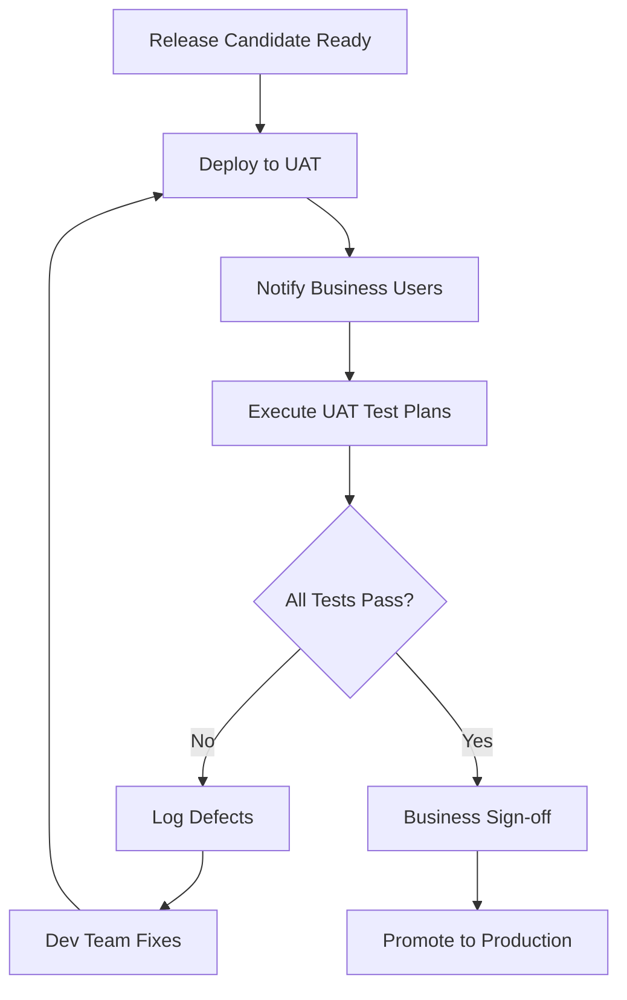

# ADR-019: Testing Standards (E2E, UAT, Regression)

**Status**: Draft (Not Implemented)
**Date**: 2026-02-01
**Deciders**: Architecture Team, QA Team, Product Team
**Tier**: Core
**Tags**: testing, e2e, uat, regression, qa

## Context
SAP-grade ERPs require comprehensive testing beyond unit and integration tests, including end-to-end business process validation, structured UAT, and regression suites. This ADR defines the testing standards and target coverage model for enterprise workflows and continuous delivery.

## Decision
Adopt a **testing standard** that defines **E2E business process tests**, **UAT environments**, and **automated regression suites**. Implementation is **not started**; this ADR defines the standard.

### Testing Layers

### Testing Pyramid for Enterprise ERP

```
                    ┌─────────────────┐
                    │   Manual UAT    │  5%
                    │  (Business Sign-off)
                    └─────────────────┘
                  ┌───────────────────────┐
                  │   E2E Business Tests   │  10%
                  │  (Order-to-Cash, P2P)  │
                  └───────────────────────┘
              ┌─────────────────────────────────┐
              │     Integration Tests            │  25%
              │  (API, Event, Database)          │
              └─────────────────────────────────┘
          ┌───────────────────────────────────────────┐
          │          Unit Tests                        │  60%
          │   (Business Logic, Domain Rules)           │
          └───────────────────────────────────────────┘
```

### Test Coverage Standards by Service Tier

| Service Tier | Unit Test | Integration | E2E | Manual UAT | Total Target |
|--------------|-----------|-------------|-----|------------|--------------|
| **Critical** (Financial API) | 85%+ | 75%+ | 90%+ | 100% | 85%+ overall |
| **High** (AR, AP, CRM) | 80%+ | 70%+ | 80%+ | 100% | 80%+ overall |
| **Medium** (Reports, Batch) | 75%+ | 60%+ | 60%+ | 80% | 70%+ overall |
| **Low** (Internal Tools) | 60%+ | 40%+ | 40%+ | 50% | 50%+ overall |

### End-to-End (E2E) Business Process Testing

### Critical Business Process Flows

| Process | Contexts Involved | Complexity | Duration | Priority |
|---------|-------------------|------------|----------|----------|
| **Order-to-Cash** | Sales → AR → GL | High | 5-8 min | P0 |
| **Procure-to-Pay** | Purchasing → AP → GL | High | 4-6 min | P0 |
| **Record-to-Report** | GL → Reporting | Medium | 3-5 min | P1 |
| **Quote-to-Order** | CRM → Sales | Medium | 2-4 min | P1 |
| **Inventory-to-COGS** | Inventory → GL | Medium | 3-5 min | P1 |
| **Multi-Currency Transaction** | All Financial | High | 6-10 min | P0 |
| **Period Close** | GL → AR → AP | Very High | 10-15 min | P0 |

### E2E Test Framework (Kotlin + REST Assured + TestContainers)

```kotlin
// E2ETestBase.kt
package com.chiroerp.e2e

import io.quarkus.test.junit.QuarkusTest
import io.restassured.RestAssured
import io.restassured.http.ContentType
import io.restassured.response.Response
import org.junit.jupiter.api.BeforeAll
import org.junit.jupiter.api.TestInstance
import org.testcontainers.containers.PostgreSQLContainer
import org.testcontainers.containers.KafkaContainer
import org.testcontainers.utility.DockerImageName
import java.util.UUID

@QuarkusTest
@TestInstance(TestInstance.Lifecycle.PER_CLASS)
abstract class E2ETestBase {

    companion object {
        val postgres = PostgreSQLContainer(DockerImageName.parse("postgres:15"))
            .withDatabaseName("chiroerp_test")
            .withUsername("test")
            .withPassword("test")

        val kafka = KafkaContainer(DockerImageName.parse("confluentinc/cp-kafka:7.5.0"))
    }

    protected val tenantId = "tenant-e2e-test"
    protected val userId = "user-e2e-test"
    protected lateinit var authToken: String

    @BeforeAll
    fun setupInfrastructure() {
        if (!postgres.isRunning) postgres.start()
        if (!kafka.isRunning) kafka.start()

        // Configure RestAssured
        RestAssured.baseURI = "http://localhost"
        RestAssured.port = 8080
        RestAssured.enableLoggingOfRequestAndResponseIfValidationFails()

        // Authenticate and get token
        authToken = authenticateTestUser()

        // Seed test data
        seedTestData()
    }

    protected fun authenticateTestUser(): String {
        val response = RestAssured.given()
            .contentType(ContentType.JSON)
            .body("""
                {
                  "username": "e2e-test-user",
                  "password": "test-password",
                  "tenantId": "$tenantId"
                }
            """)
            .post("/api/v1/auth/login")
            .then()
            .statusCode(200)
            .extract()
            .response()

        return response.jsonPath().getString("accessToken")
    }

    protected fun seedTestData() {
        // Seed chart of accounts
        createAccount("1000", "Cash", "ASSET")
        createAccount("4000", "Revenue", "REVENUE")
        createAccount("5000", "COGS", "EXPENSE")
        createAccount("2000", "Accounts Receivable", "ASSET")
        createAccount("2100", "Accounts Payable", "LIABILITY")

        // Seed customers and vendors
        createCustomer("CUST-001", "Acme Corp")
        createVendor("VEND-001", "Supplier Inc")
    }

    protected fun createAccount(code: String, name: String, type: String): String {
        val response = RestAssured.given()
            .header("Authorization", "Bearer $authToken")
            .contentType(ContentType.JSON)
            .body("""
                {
                  "tenantId": "$tenantId",
                  "accountCode": "$code",
                  "accountName": "$name",
                  "accountType": "$type",
                  "currency": "USD"
                }
            """)
            .post("/api/v1/gl/accounts")
            .then()
            .statusCode(201)
            .extract()
            .response()

        return response.jsonPath().getString("id")
    }

    protected fun createCustomer(code: String, name: String): String {
        val response = RestAssured.given()
            .header("Authorization", "Bearer $authToken")
            .contentType(ContentType.JSON)
            .body("""
                {
                  "tenantId": "$tenantId",
                  "customerCode": "$code",
                  "customerName": "$name",
                  "email": "$code@example.com",
                  "paymentTerms": "NET30"
                }
            """)
            .post("/api/v1/ar/customers")
            .then()
            .statusCode(201)
            .extract()
            .response()

        return response.jsonPath().getString("id")
    }

    protected fun createVendor(code: String, name: String): String {
        val response = RestAssured.given()
            .header("Authorization", "Bearer $authToken")
            .contentType(ContentType.JSON)
            .body("""
                {
                  "tenantId": "$tenantId",
                  "vendorCode": "$code",
                  "vendorName": "$name",
                  "email": "$code@example.com",
                  "paymentTerms": "NET30"
                }
            """)
            .post("/api/v1/ap/vendors")
            .then()
            .statusCode(201)
            .extract()
            .response()

        return response.jsonPath().getString("id")
    }

    protected fun waitForEvent(eventType: String, maxWaitSeconds: Int = 30): Boolean {
        // Poll for event in Kafka or event store
        val startTime = System.currentTimeMillis()
        while (System.currentTimeMillis() - startTime < maxWaitSeconds * 1000) {
            if (eventExists(eventType)) return true
            Thread.sleep(500)
        }
        return false
    }

    private fun eventExists(eventType: String): Boolean {
        // Check event store or Kafka topic
        // Implementation depends on event infrastructure
        return true // Simplified for example
    }
}
```

### E2E Test: Order-to-Cash Flow

```kotlin
// OrderToCashE2ETest.kt
package com.chiroerp.e2e.processes

import com.chiroerp.e2e.E2ETestBase
import io.restassured.RestAssured
import io.restassured.http.ContentType
import org.junit.jupiter.api.Test
import org.junit.jupiter.api.Order
import org.junit.jupiter.api.TestMethodOrder
import org.junit.jupiter.api.MethodOrderer
import org.hamcrest.Matchers.*
import java.math.BigDecimal

@TestMethodOrder(MethodOrderer.OrderAnnotation::class)
class OrderToCashE2ETest : E2ETestBase() {

    private var salesOrderId: String = ""
    private var invoiceId: String = ""
    private var paymentId: String = ""
    private var journalEntryId: String = ""

    /**
     * Complete Order-to-Cash flow:
     * 1. Create Sales Order
     * 2. Fulfill Sales Order → Creates Invoice
     * 3. Invoice posts to GL (DR AR, CR Revenue)
     * 4. Customer Payment received → Posts to GL (DR Cash, CR AR)
     * 5. Verify final balances
     */

    @Test
    @Order(1)
    fun `step 1 - create sales order`() {
        val response = RestAssured.given()
            .header("Authorization", "Bearer $authToken")
            .contentType(ContentType.JSON)
            .body("""
                {
                  "tenantId": "$tenantId",
                  "customerCode": "CUST-001",
                  "orderDate": "2026-02-01",
                  "currency": "USD",
                  "lineItems": [
                    {
                      "productCode": "PROD-001",
                      "description": "Widget A",
                      "quantity": 10,
                      "unitPrice": 100.00,
                      "amount": 1000.00
                    },
                    {
                      "productCode": "PROD-002",
                      "description": "Widget B",
                      "quantity": 5,
                      "unitPrice": 200.00,
                      "amount": 1000.00
                    }
                  ],
                  "totalAmount": 2000.00
                }
            """)
            .post("/api/v1/sales/orders")
            .then()
            .statusCode(201)
            .body("status", equalTo("PENDING"))
            .body("totalAmount", equalTo(2000.00f))
            .extract()
            .response()

        salesOrderId = response.jsonPath().getString("id")
        println("✓ Sales Order Created: $salesOrderId")
    }

    @Test
    @Order(2)
    fun `step 2 - fulfill sales order and generate invoice`() {
        // Fulfill the order
        RestAssured.given()
            .header("Authorization", "Bearer $authToken")
            .contentType(ContentType.JSON)
            .body("""{"fulfillmentDate": "2026-02-01"}""")
            .post("/api/v1/sales/orders/$salesOrderId/fulfill")
            .then()
            .statusCode(200)
            .body("status", equalTo("FULFILLED"))

        // Wait for invoice creation event
        assert(waitForEvent("InvoiceCreated", 10)) { "Invoice creation event not received" }

        // Get generated invoice
        val response = RestAssured.given()
            .header("Authorization", "Bearer $authToken")
            .queryParam("salesOrderId", salesOrderId)
            .get("/api/v1/ar/invoices")
            .then()
            .statusCode(200)
            .body("items", hasSize<Int>(1))
            .extract()
            .response()

        invoiceId = response.jsonPath().getString("items[0].id")
        println("✓ Invoice Generated: $invoiceId")
    }

    @Test
    @Order(3)
    fun `step 3 - invoice posts to general ledger`() {
        // Post invoice to GL
        val response = RestAssured.given()
            .header("Authorization", "Bearer $authToken")
            .post("/api/v1/ar/invoices/$invoiceId/post")
            .then()
            .statusCode(200)
            .body("posted", equalTo(true))
            .extract()
            .response()

        journalEntryId = response.jsonPath().getString("journalEntryId")

        // Wait for GL posting event
        assert(waitForEvent("JournalEntryPosted", 10)) { "GL posting event not received" }

        // Verify journal entry
        RestAssured.given()
            .header("Authorization", "Bearer $authToken")
            .get("/api/v1/gl/journal-entries/$journalEntryId")
            .then()
            .statusCode(200)
            .body("status", equalTo("POSTED"))
            .body("lineItems", hasSize<Int>(2))
            .body("lineItems.find { it.accountCode == '2000' }.debit", equalTo(2000.00f)) // DR AR
            .body("lineItems.find { it.accountCode == '4000' }.credit", equalTo(2000.00f)) // CR Revenue

        println("✓ Journal Entry Posted: $journalEntryId")
        println("  - DR Accounts Receivable (2000): $2,000.00")
        println("  - CR Revenue (4000): $2,000.00")
    }

    @Test
    @Order(4)
    fun `step 4 - receive customer payment`() {
        val response = RestAssured.given()
            .header("Authorization", "Bearer $authToken")
            .contentType(ContentType.JSON)
            .body("""
                {
                  "tenantId": "$tenantId",
                  "customerCode": "CUST-001",
                  "paymentDate": "2026-02-05",
                  "amount": 2000.00,
                  "currency": "USD",
                  "paymentMethod": "CHECK",
                  "referenceNumber": "CHK-12345",
                  "appliedInvoices": [
                    {
                      "invoiceId": "$invoiceId",
                      "amount": 2000.00
                    }
                  ]
                }
            """)
            .post("/api/v1/ar/payments")
            .then()
            .statusCode(201)
            .body("status", equalTo("POSTED"))
            .body("appliedAmount", equalTo(2000.00f))
            .extract()
            .response()

        paymentId = response.jsonPath().getString("id")
        val paymentJournalEntryId = response.jsonPath().getString("journalEntryId")

        // Wait for payment posting event
        assert(waitForEvent("PaymentPosted", 10)) { "Payment posting event not received" }

        // Verify payment journal entry
        RestAssured.given()
            .header("Authorization", "Bearer $authToken")
            .get("/api/v1/gl/journal-entries/$paymentJournalEntryId")
            .then()
            .statusCode(200)
            .body("status", equalTo("POSTED"))
            .body("lineItems", hasSize<Int>(2))
            .body("lineItems.find { it.accountCode == '1000' }.debit", equalTo(2000.00f)) // DR Cash
            .body("lineItems.find { it.accountCode == '2000' }.credit", equalTo(2000.00f)) // CR AR

        println("✓ Payment Received: $paymentId")
        println("  - DR Cash (1000): $2,000.00")
        println("  - CR Accounts Receivable (2000): $2,000.00")
    }

    @Test
    @Order(5)
    fun `step 5 - verify final account balances`() {
        // Check Cash balance (should be +$2,000)
        RestAssured.given()
            .header("Authorization", "Bearer $authToken")
            .queryParam("accountCode", "1000")
            .get("/api/v1/gl/accounts/balance")
            .then()
            .statusCode(200)
            .body("balance", equalTo(2000.00f))
            .body("balanceType", equalTo("DEBIT"))

        // Check AR balance (should be $0 - invoice and payment offset)
        RestAssured.given()
            .header("Authorization", "Bearer $authToken")
            .queryParam("accountCode", "2000")
            .get("/api/v1/gl/accounts/balance")
            .then()
            .statusCode(200)
            .body("balance", equalTo(0.00f))

        // Check Revenue balance (should be +$2,000)
        RestAssured.given()
            .header("Authorization", "Bearer $authToken")
            .queryParam("accountCode", "4000")
            .get("/api/v1/gl/accounts/balance")
            .then()
            .statusCode(200)
            .body("balance", equalTo(2000.00f))
            .body("balanceType", equalTo("CREDIT"))

        // Verify invoice is fully paid
        RestAssured.given()
            .header("Authorization", "Bearer $authToken")
            .get("/api/v1/ar/invoices/$invoiceId")
            .then()
            .statusCode(200)
            .body("status", equalTo("PAID"))
            .body("remainingBalance", equalTo(0.00f))

        println("✓ Order-to-Cash Complete - All Balances Verified")
        println("  - Cash: $2,000.00 DR")
        println("  - Accounts Receivable: $0.00")
        println("  - Revenue: $2,000.00 CR")
    }
}
```

### E2E Test: Procure-to-Pay Flow

```kotlin
// ProcureToPayE2ETest.kt
package com.chiroerp.e2e.processes

import com.chiroerp.e2e.E2ETestBase
import io.restassured.RestAssured
import io.restassured.http.ContentType
import org.junit.jupiter.api.Test
import org.junit.jupiter.api.Order
import org.junit.jupiter.api.TestMethodOrder
import org.junit.jupiter.api.MethodOrderer
import org.hamcrest.Matchers.*

@TestMethodOrder(MethodOrderer.OrderAnnotation::class)
class ProcureToPayE2ETest : E2ETestBase() {

    private var purchaseOrderId: String = ""
    private var billId: String = ""
    private var paymentId: String = ""

    /**
     * Complete Procure-to-Pay flow:
     * 1. Create Purchase Order
     * 2. Receive goods → Creates Bill
     * 3. Bill posts to GL (DR Expense/Inventory, CR AP)
     * 4. Vendor Payment → Posts to GL (DR AP, CR Cash)
     * 5. Verify final balances
     */

    @Test
    @Order(1)
    fun `step 1 - create purchase order`() {
        val response = RestAssured.given()
            .header("Authorization", "Bearer $authToken")
            .contentType(ContentType.JSON)
            .body("""
                {
                  "tenantId": "$tenantId",
                  "vendorCode": "VEND-001",
                  "orderDate": "2026-02-01",
                  "currency": "USD",
                  "lineItems": [
                    {
                      "description": "Office Supplies",
                      "quantity": 100,
                      "unitPrice": 5.00,
                      "amount": 500.00
                    }
                  ],
                  "totalAmount": 500.00
                }
            """)
            .post("/api/v1/purchasing/orders")
            .then()
            .statusCode(201)
            .body("status", equalTo("PENDING"))
            .extract()
            .response()

        purchaseOrderId = response.jsonPath().getString("id")
        println("✓ Purchase Order Created: $purchaseOrderId")
    }

    @Test
    @Order(2)
    fun `step 2 - receive goods and generate bill`() {
        // Mark PO as received
        RestAssured.given()
            .header("Authorization", "Bearer $authToken")
            .contentType(ContentType.JSON)
            .body("""{"receiptDate": "2026-02-03"}""")
            .post("/api/v1/purchasing/orders/$purchaseOrderId/receive")
            .then()
            .statusCode(200)
            .body("status", equalTo("RECEIVED"))

        // Wait for bill creation event
        assert(waitForEvent("BillCreated", 10)) { "Bill creation event not received" }

        // Get generated bill
        val response = RestAssured.given()
            .header("Authorization", "Bearer $authToken")
            .queryParam("purchaseOrderId", purchaseOrderId)
            .get("/api/v1/ap/bills")
            .then()
            .statusCode(200)
            .body("items", hasSize<Int>(1))
            .extract()
            .response()

        billId = response.jsonPath().getString("items[0].id")
        println("✓ Bill Generated: $billId")
    }

    @Test
    @Order(3)
    fun `step 3 - bill posts to general ledger`() {
        // Post bill to GL
        val response = RestAssured.given()
            .header("Authorization", "Bearer $authToken")
            .post("/api/v1/ap/bills/$billId/post")
            .then()
            .statusCode(200)
            .body("posted", equalTo(true))
            .extract()
            .response()

        val journalEntryId = response.jsonPath().getString("journalEntryId")

        // Verify journal entry
        RestAssured.given()
            .header("Authorization", "Bearer $authToken")
            .get("/api/v1/gl/journal-entries/$journalEntryId")
            .then()
            .statusCode(200)
            .body("lineItems", hasSize<Int>(2))
            .body("lineItems.find { it.accountCode == '5000' }.debit", equalTo(500.00f)) // DR Expense
            .body("lineItems.find { it.accountCode == '2100' }.credit", equalTo(500.00f)) // CR AP

        println("✓ Bill Posted to GL")
        println("  - DR Expense (5000): $500.00")
        println("  - CR Accounts Payable (2100): $500.00")
    }

    @Test
    @Order(4)
    fun `step 4 - pay vendor`() {
        val response = RestAssured.given()
            .header("Authorization", "Bearer $authToken")
            .contentType(ContentType.JSON)
            .body("""
                {
                  "tenantId": "$tenantId",
                  "vendorCode": "VEND-001",
                  "paymentDate": "2026-02-10",
                  "amount": 500.00,
                  "currency": "USD",
                  "paymentMethod": "ACH",
                  "referenceNumber": "ACH-67890",
                  "appliedBills": [
                    {
                      "billId": "$billId",
                      "amount": 500.00
                    }
                  ]
                }
            """)
            .post("/api/v1/ap/payments")
            .then()
            .statusCode(201)
            .body("status", equalTo("POSTED"))
            .extract()
            .response()

        paymentId = response.jsonPath().getString("id")
        val paymentJournalEntryId = response.jsonPath().getString("journalEntryId")

        // Verify payment journal entry
        RestAssured.given()
            .header("Authorization", "Bearer $authToken")
            .get("/api/v1/gl/journal-entries/$paymentJournalEntryId")
            .then()
            .statusCode(200)
            .body("lineItems", hasSize<Int>(2))
            .body("lineItems.find { it.accountCode == '2100' }.debit", equalTo(500.00f)) // DR AP
            .body("lineItems.find { it.accountCode == '1000' }.credit", equalTo(500.00f)) // CR Cash

        println("✓ Vendor Payment Made: $paymentId")
        println("  - DR Accounts Payable (2100): $500.00")
        println("  - CR Cash (1000): $500.00")
    }

    @Test
    @Order(5)
    fun `step 5 - verify final account balances`() {
        // Check AP balance (should be $0)
        RestAssured.given()
            .header("Authorization", "Bearer $authToken")
            .queryParam("accountCode", "2100")
            .get("/api/v1/gl/accounts/balance")
            .then()
            .statusCode(200)
            .body("balance", equalTo(0.00f))

        // Check Expense balance (should be +$500 DR)
        RestAssured.given()
            .header("Authorization", "Bearer $authToken")
            .queryParam("accountCode", "5000")
            .get("/api/v1/gl/accounts/balance")
            .then()
            .statusCode(200)
            .body("balance", equalTo(500.00f))
            .body("balanceType", equalTo("DEBIT"))

        // Verify bill is fully paid
        RestAssured.given()
            .header("Authorization", "Bearer $authToken")
            .get("/api/v1/ap/bills/$billId")
            .then()
            .statusCode(200)
            .body("status", equalTo("PAID"))
            .body("remainingBalance", equalTo(0.00f))

        println("✓ Procure-to-Pay Complete - All Balances Verified")
    }
}
```

### User Acceptance Testing (UAT)

### UAT Environment Configuration

| Environment | Purpose | Data Source | Refresh Frequency | Access |
|-------------|---------|-------------|-------------------|---------|
| **UAT-Staging** | Pre-release validation | Anonymized prod snapshot | Weekly | Business users + QA |
| **UAT-Training** | User training | Synthetic seed data | Monthly | All users |
| **UAT-Demo** | Sales demos | Curated demo scenarios | On-demand | Sales + Product |

### UAT Process Workflow



### UAT Test Plan Template

```markdown
# UAT Test Plan: [Feature Name]

**Release**: v1.2.3
**UAT Period**: 2026-02-10 to 2026-02-14
**Business Owner**: [Name]
**QA Lead**: [Name]

### Scope

- [ ] Feature 1: Multi-currency invoice creation
- [ ] Feature 2: Automated payment matching
- [ ] Feature 3: Enhanced aging report

### Test Scenarios

### Scenario 1: Create Multi-Currency Invoice

**Pre-conditions**:
- User logged in as AR Clerk
- Customer with EUR payment terms exists
- Exchange rates configured

**Steps**:
1. Navigate to AR > Invoices > New
2. Select customer "CUST-EU-001"
3. Add line item: Product A, Qty 10, Price EUR 50.00
4. Verify total: EUR 500.00
5. Verify USD equivalent displayed (using daily rate)
6. Save invoice
7. Post invoice to GL

**Expected Results**:
- Invoice created with status "DRAFT"
- Exchange rate locked at creation time
- GL entry shows both EUR and USD amounts
- AR balance updated in USD

**Actual Results**: _[To be filled by tester]_

**Status**: ⬜ Pass / ⬜ Fail / ⬜ Blocked

**Notes**: _[Any issues or observations]_

### Scenario 2: Apply Payment to Multi-Currency Invoice

**Pre-conditions**:
- Invoice from Scenario 1 exists and posted
- Bank account configured for EUR

**Steps**:
1. Navigate to AR > Payments > New
2. Select customer "CUST-EU-001"
3. Enter payment amount: EUR 500.00
4. Select payment method: Wire Transfer
5. Apply to open invoice
6. Post payment

**Expected Results**:
- Payment applied successfully
- Invoice status: "PAID"
- AR balance reduced by EUR 500.00 (USD equivalent)
- Cash account increased

**Actual Results**: _[To be filled by tester]_

**Status**: ⬜ Pass / ⬜ Fail / ⬜ Blocked

**Notes**: _[Any issues or observations]_

### Defect Log

| ID | Scenario | Description | Severity | Status | Assigned To |
|----|----------|-------------|----------|--------|-------------|
| D-001 | Scenario 1 | Exchange rate not locking | High | Open | Dev Team |
| D-002 | Scenario 2 | Payment rounding issue | Medium | Fixed | Dev Team |

### Sign-off

**Business Owner Approval**:
- [ ] All critical scenarios pass
- [ ] Defects acceptable for production
- [ ] User experience acceptable

**Signature**: _________________ **Date**: _________

**QA Lead Approval**:
- [ ] Test plan 100% executed
- [ ] All P0/P1 defects resolved
- [ ] Regression tests pass

**Signature**: _________________ **Date**: _________
```

### UAT Test Execution Tracking

```kotlin
// UATTestExecutor.kt
package com.chiroerp.uat

import jakarta.enterprise.context.ApplicationScoped
import jakarta.inject.Inject
import java.time.Instant

@ApplicationScoped
class UATTestExecutor {

    @Inject
    lateinit var testRepository: UATTestRepository

    @Inject
    lateinit var notificationService: NotificationService

    fun createUATSession(
        releaseVersion: String,
        features: List<String>,
        businessOwners: List<String>,
        startDate: Instant,
        endDate: Instant
    ): UATSession {
        val session = UATSession(
            id = UUID.randomUUID(),
            releaseVersion = releaseVersion,
            features = features,
            businessOwners = businessOwners,
            startDate = startDate,
            endDate = endDate,
            status = UATStatus.PENDING,
            testScenarios = generateTestScenarios(features),
            createdAt = Instant.now()
        )

        testRepository.save(session)

        // Notify business owners
        businessOwners.forEach { owner ->
            notificationService.sendEmail(
                to = owner,
                subject = "UAT Required: Release $releaseVersion",
                body = generateUATInvitation(session)
            )
        }

        return session
    }

    fun recordTestResult(
        sessionId: UUID,
        scenarioId: String,
        result: TestResult,
        notes: String?,
        tester: String
    ): UATTestResult {
        val testResult = UATTestResult(
            id = UUID.randomUUID(),
            sessionId = sessionId,
            scenarioId = scenarioId,
            result = result,
            notes = notes,
            tester = tester,
            executedAt = Instant.now()
        )

        testRepository.saveResult(testResult)

        // Check if session complete
        val session = testRepository.findSession(sessionId)
        if (isSessionComplete(session)) {
            session.status = UATStatus.COMPLETED
            session.completedAt = Instant.now()
            testRepository.update(session)

            notificationService.sendSlack(
                channel = "#releases",
                message = "🎉 UAT Complete for ${session.releaseVersion}: ${getPassRate(session)}% pass rate"
            )
        }

        return testResult
    }

    fun logDefect(
        sessionId: UUID,
        scenarioId: String,
        description: String,
        severity: DefectSeverity,
        reporter: String
    ): Defect {
        val defect = Defect(
            id = "D-${System.currentTimeMillis()}",
            sessionId = sessionId,
            scenarioId = scenarioId,
            description = description,
            severity = severity,
            status = DefectStatus.OPEN,
            reporter = reporter,
            createdAt = Instant.now()
        )

        testRepository.saveDefect(defect)

        // Alert dev team for P0/P1
        if (severity in listOf(DefectSeverity.CRITICAL, DefectSeverity.HIGH)) {
            notificationService.sendSlack(
                channel = "#dev-team",
                message = "🚨 ${severity} UAT Defect: ${defect.id} - $description"
            )
        }

        return defect
    }

    fun requestSignoff(sessionId: UUID): Boolean {
        val session = testRepository.findSession(sessionId)

        // Verify all tests executed
        val allTestsRun = session.testScenarios.all { scenario ->
            testRepository.hasResult(sessionId, scenario.id)
        }

        if (!allTestsRun) {
            throw IllegalStateException("Cannot request sign-off: Not all tests executed")
        }

        // Check for blocking defects
        val blockingDefects = testRepository.findDefects(sessionId)
            .filter { it.severity in listOf(DefectSeverity.CRITICAL, DefectSeverity.HIGH) }
            .filter { it.status != DefectStatus.RESOLVED }

        if (blockingDefects.isNotEmpty()) {
            throw IllegalStateException("Cannot request sign-off: ${blockingDefects.size} blocking defects remain")
        }

        // Request sign-off from business owners
        session.businessOwners.forEach { owner ->
            notificationService.sendEmail(
                to = owner,
                subject = "Sign-off Required: ${session.releaseVersion}",
                body = generateSignoffRequest(session)
            )
        }

        session.status = UATStatus.AWAITING_SIGNOFF
        testRepository.update(session)

        return true
    }
}

data class UATSession(
    val id: UUID,
    val releaseVersion: String,
    val features: List<String>,
    val businessOwners: List<String>,
    val startDate: Instant,
    val endDate: Instant,
    var status: UATStatus,
    val testScenarios: List<TestScenario>,
    val createdAt: Instant,
    var completedAt: Instant? = null
)

data class TestScenario(
    val id: String,
    val name: String,
    val description: String,
    val steps: List<String>,
    val expectedResults: List<String>,
    val priority: TestPriority
)

data class UATTestResult(
    val id: UUID,
    val sessionId: UUID,
    val scenarioId: String,
    val result: TestResult,
    val notes: String?,
    val tester: String,
    val executedAt: Instant
)

data class Defect(
    val id: String,
    val sessionId: UUID,
    val scenarioId: String,
    val description: String,
    val severity: DefectSeverity,
    var status: DefectStatus,
    val reporter: String,
    val createdAt: Instant,
    var resolvedAt: Instant? = null
)

enum class UATStatus {
    PENDING, IN_PROGRESS, COMPLETED, AWAITING_SIGNOFF, APPROVED, REJECTED
}

enum class TestResult {
    PASS, FAIL, BLOCKED, SKIPPED
}

enum class TestPriority {
    P0_CRITICAL, P1_HIGH, P2_MEDIUM, P3_LOW
}

enum class DefectSeverity {
    CRITICAL, HIGH, MEDIUM, LOW
}

enum class DefectStatus {
    OPEN, IN_PROGRESS, RESOLVED, CLOSED, WONT_FIX
}
```

### Regression Testing

### Regression Test Suite Structure

```
regression-tests/
├── critical/                 # P0 - Block release if fail
│   ├── authentication/
│   │   ├── login_test.kt
│   │   └── mfa_test.kt
│   ├── financial/
│   │   ├── journal_entry_posting_test.kt
│   │   ├── invoice_creation_test.kt
│   │   └── payment_processing_test.kt
│   └── authorization/
│       ├── rbac_test.kt
│       └── sod_validation_test.kt
│
├── high/                     # P1 - Alert but don't block
│   ├── reporting/
│   │   ├── balance_sheet_test.kt
│   │   └── aging_report_test.kt
│   └── integrations/
│       ├── kafka_event_processing_test.kt
│       └── api_contracts_test.kt
│
└── medium/                   # P2 - Track for future fix
    ├── ui/
    │   └── dashboard_rendering_test.kt
    └── performance/
        └── load_test.kt
```

### Regression Test: Critical Financial Operations

```kotlin
// JournalEntryRegressionTest.kt
package com.chiroerp.regression.critical

import io.quarkus.test.junit.QuarkusTest
import io.restassured.RestAssured
import io.restassured.http.ContentType
import org.junit.jupiter.api.Test
import org.junit.jupiter.api.Tag
import org.hamcrest.Matchers.*

@QuarkusTest
@Tag("regression")
@Tag("critical")
class JournalEntryRegressionTest {

    /**
     * Regression Test: Journal Entry Posting
     *
     * Validates:
     * - Debit/credit balance
     * - Account code validation
     * - Multi-currency handling
     * - Period close enforcement
     * - Audit trail creation
     */

    @Test
    fun `journal entry with balanced debits and credits posts successfully`() {
        val authToken = authenticate()

        RestAssured.given()
            .header("Authorization", "Bearer $authToken")
            .contentType(ContentType.JSON)
            .body("""
                {
                  "tenantId": "tenant-regression",
                  "entryDate": "2026-02-01",
                  "description": "Test balanced entry",
                  "lineItems": [
                    {
                      "accountCode": "1000",
                      "debit": 1000.00,
                      "credit": 0.00,
                      "description": "Cash increase"
                    },
                    {
                      "accountCode": "4000",
                      "debit": 0.00,
                      "credit": 1000.00,
                      "description": "Revenue recognition"
                    }
                  ]
                }
            """)
            .post("/api/v1/gl/journal-entries")
            .then()
            .statusCode(201)
            .body("status", equalTo("POSTED"))
            .body("totalDebit", equalTo(1000.00f))
            .body("totalCredit", equalTo(1000.00f))
    }

    @Test
    fun `journal entry with unbalanced debits and credits is rejected`() {
        val authToken = authenticate()

        RestAssured.given()
            .header("Authorization", "Bearer $authToken")
            .contentType(ContentType.JSON)
            .body("""
                {
                  "tenantId": "tenant-regression",
                  "entryDate": "2026-02-01",
                  "description": "Test unbalanced entry",
                  "lineItems": [
                    {
                      "accountCode": "1000",
                      "debit": 1000.00,
                      "credit": 0.00
                    },
                    {
                      "accountCode": "4000",
                      "debit": 0.00,
                      "credit": 500.00
                    }
                  ]
                }
            """)
            .post("/api/v1/gl/journal-entries")
            .then()
            .statusCode(400)
            .body("error", equalTo("UNBALANCED_ENTRY"))
            .body("message", containsString("Debits and credits must balance"))
    }

    @Test
    fun `journal entry with invalid account code is rejected`() {
        val authToken = authenticate()

        RestAssured.given()
            .header("Authorization", "Bearer $authToken")
            .contentType(ContentType.JSON)
            .body("""
                {
                  "tenantId": "tenant-regression",
                  "entryDate": "2026-02-01",
                  "description": "Test invalid account",
                  "lineItems": [
                    {
                      "accountCode": "9999",
                      "debit": 1000.00,
                      "credit": 0.00
                    },
                    {
                      "accountCode": "4000",
                      "debit": 0.00,
                      "credit": 1000.00
                    }
                  ]
                }
            """)
            .post("/api/v1/gl/journal-entries")
            .then()
            .statusCode(400)
            .body("error", equalTo("INVALID_ACCOUNT"))
            .body("invalidAccountCodes", hasItem("9999"))
    }

    @Test
    fun `journal entry in closed period is rejected`() {
        val authToken = authenticate()

        // Close period 2026-01
        closePeriod(authToken, "2026-01")

        // Attempt to post entry in closed period
        RestAssured.given()
            .header("Authorization", "Bearer $authToken")
            .contentType(ContentType.JSON)
            .body("""
                {
                  "tenantId": "tenant-regression",
                  "entryDate": "2026-01-31",
                  "description": "Test closed period",
                  "lineItems": [
                    {
                      "accountCode": "1000",
                      "debit": 1000.00,
                      "credit": 0.00
                    },
                    {
                      "accountCode": "4000",
                      "debit": 0.00,
                      "credit": 1000.00
                    }
                  ]
                }
            """)
            .post("/api/v1/gl/journal-entries")
            .then()
            .statusCode(400)
            .body("error", equalTo("PERIOD_CLOSED"))
            .body("message", containsString("Period 2026-01 is closed"))
    }

    @Test
    fun `journal entry creates complete audit trail`() {
        val authToken = authenticate()

        val response = RestAssured.given()
            .header("Authorization", "Bearer $authToken")
            .contentType(ContentType.JSON)
            .body("""
                {
                  "tenantId": "tenant-regression",
                  "entryDate": "2026-02-01",
                  "description": "Test audit trail",
                  "lineItems": [
                    {
                      "accountCode": "1000",
                      "debit": 1000.00,
                      "credit": 0.00
                    },
                    {
                      "accountCode": "4000",
                      "debit": 0.00,
                      "credit": 1000.00
                    }
                  ]
                }
            """)
            .post("/api/v1/gl/journal-entries")
            .then()
            .statusCode(201)
            .extract()
            .response()

        val journalEntryId = response.jsonPath().getString("id")

        // Verify audit trail
        RestAssured.given()
            .header("Authorization", "Bearer $authToken")
            .get("/api/v1/audit-log?entityType=JOURNAL_ENTRY&entityId=$journalEntryId")
            .then()
            .statusCode(200)
            .body("items", hasSize<Int>(greaterThan(0)))
            .body("items[0].action", equalTo("CREATE"))
            .body("items[0].userId", notNullValue())
            .body("items[0].timestamp", notNullValue())
            .body("items[0].changes", notNullValue())
    }

    private fun authenticate(): String {
        // Authentication helper
        return "test-token"
    }

    private fun closePeriod(token: String, period: String) {
        RestAssured.given()
            .header("Authorization", "Bearer $token")
            .post("/api/v1/gl/periods/$period/close")
    }
}
```

### Regression Test Automation (CI/CD Integration)

```yaml
# .gitlab-ci.yml
stages:
  - build
  - test:unit
  - test:integration
  - test:regression
  - test:e2e
  - deploy

regression:critical:
  stage: test:regression
  image: maven:3.8-openjdk-17
  services:
    - postgres:15
    - confluentinc/cp-kafka:7.5.0
  script:
    - mvn clean test -Dtest.groups=regression,critical
    - mvn surefire-report:report
  artifacts:
    when: always
    reports:
      junit: target/surefire-reports/TEST-*.xml
    paths:
      - target/surefire-reports/
  rules:
    - if: '$CI_PIPELINE_SOURCE == "merge_request"'
      when: always
    - if: '$CI_COMMIT_BRANCH == "main"'
      when: always
  allow_failure: false  # Block pipeline if critical regression fails

regression:high:
  stage: test:regression
  image: maven:3.8-openjdk-17
  services:
    - postgres:15
    - confluentinc/cp-kafka:7.5.0
  script:
    - mvn clean test -Dtest.groups=regression,high
    - mvn surefire-report:report
  artifacts:
    when: always
    reports:
      junit: target/surefire-reports/TEST-*.xml
  rules:
    - if: '$CI_PIPELINE_SOURCE == "merge_request"'
      when: always
  allow_failure: true  # Don't block but alert on failure

regression:medium:
  stage: test:regression
  image: maven:3.8-openjdk-17
  script:
    - mvn clean test -Dtest.groups=regression,medium
  rules:
    - if: '$CI_COMMIT_BRANCH == "main"'
      when: always
  allow_failure: true
```

### Test Data Management

### Test Data Strategy

| Data Type | Source | Refresh Frequency | Anonymization | Volume |
|-----------|--------|-------------------|---------------|--------|
| **Customer Master** | Production snapshot | Weekly | Full PII masking | 10,000 records |
| **Vendor Master** | Production snapshot | Weekly | Full PII masking | 5,000 records |
| **Chart of Accounts** | Production snapshot | Monthly | None (no PII) | 500 accounts |
| **Transactions (GL)** | Synthetic generation | Daily | N/A | 50,000/month |
| **Transactions (AR/AP)** | Synthetic generation | Daily | N/A | 20,000/month |
| **Exchange Rates** | Production snapshot | Daily | None | 30 currencies |
| **Authorization Objects** | Configuration | Per release | None | 200 objects |
| **User/Tenant Data** | Synthetic | On-demand | N/A | 100 users, 10 tenants |

### Data Anonymization Procedures

```kotlin
// DataAnonymizer.kt
package com.chiroerp.testdata

import jakarta.enterprise.context.ApplicationScoped
import java.security.MessageDigest
import kotlin.random.Random

@ApplicationScoped
class DataAnonymizer {

    private val faker = Faker()

    fun anonymizeCustomer(customer: Customer): Customer {
        return customer.copy(
            name = generateFakeName(customer.id),
            email = generateFakeEmail(customer.id),
            phone = generateFakePhone(),
            address = anonymizeAddress(customer.address),
            taxId = generateFakeTaxId(customer.country),
            contactPerson = generateFakeName(customer.id + "_contact"),
            // Keep structural data intact
            creditLimit = customer.creditLimit,
            paymentTerms = customer.paymentTerms,
            customerGroup = customer.customerGroup,
            country = customer.country,
            currency = customer.currency
        )
    }

    fun anonymizeVendor(vendor: Vendor): Vendor {
        return vendor.copy(
            name = generateFakeCompanyName(vendor.id),
            email = generateFakeEmail(vendor.id),
            phone = generateFakePhone(),
            address = anonymizeAddress(vendor.address),
            taxId = generateFakeTaxId(vendor.country),
            bankAccount = generateFakeIBAN(vendor.country),
            contactPerson = generateFakeName(vendor.id + "_contact")
        )
    }

    fun anonymizeTransaction(transaction: GLTransaction): GLTransaction {
        return transaction.copy(
            // Keep financial data for testing
            amount = transaction.amount,
            debit = transaction.debit,
            credit = transaction.credit,
            accountCode = transaction.accountCode,
            // Anonymize descriptions
            description = anonymizeDescription(transaction.description),
            reference = generateFakeReference(transaction.id),
            // Remove any PII from metadata
            metadata = anonymizeMetadata(transaction.metadata)
        )
    }

    private fun generateFakeName(seed: String): String {
        // Deterministic fake names for repeatability
        val hash = md5(seed).take(8)
        val firstNames = listOf("Alice", "Bob", "Charlie", "Diana", "Eve", "Frank")
        val lastNames = listOf("Smith", "Johnson", "Williams", "Brown", "Jones", "Garcia")

        val firstIdx = hash.take(4).toInt(16) % firstNames.size
        val lastIdx = hash.takeLast(4).toInt(16) % lastNames.size

        return "${firstNames[firstIdx]} ${lastNames[lastIdx]}"
    }

    private fun generateFakeEmail(seed: String): String {
        val hash = md5(seed).take(8)
        return "test_${hash}@example.com"
    }

    private fun generateFakePhone(): String {
        return "+1-555-${Random.nextInt(100, 999)}-${Random.nextInt(1000, 9999)}"
    }

    private fun anonymizeAddress(address: Address): Address {
        return Address(
            street = "${Random.nextInt(1, 9999)} Test Street",
            city = "Test City",
            state = address.state,  // Keep for tax logic
            postalCode = generateFakePostalCode(address.country),
            country = address.country  // Keep for compliance testing
        )
    }

    private fun generateFakeTaxId(country: String): String {
        return when (country) {
            "US" -> "XX-XXXXXXX${Random.nextInt(10, 99)}"
            "CA" -> "${Random.nextInt(100000000, 999999999)}"
            "DE" -> "DE${Random.nextInt(100000000, 999999999)}"
            else -> "TEST-${Random.nextInt(100000, 999999)}"
        }
    }

    private fun generateFakeIBAN(country: String): String {
        return when (country) {
            "DE" -> "DE89370400440532013000"
            "GB" -> "GB29NWBK60161331926819"
            "FR" -> "FR1420041010050500013M02606"
            else -> "TEST${Random.nextInt(10000000, 99999999)}"
        }
    }

    private fun anonymizeDescription(description: String): String {
        // Remove potential PII while keeping business context
        return description
            .replace(Regex("[A-Z][a-z]+ [A-Z][a-z]+"), "Test Customer")
            .replace(Regex("\\b\\d{3}-\\d{2}-\\d{4}\\b"), "XXX-XX-XXXX")
            .replace(Regex("\\b[A-Za-z0-9._%+-]+@[A-Za-z0-9.-]+\\.[A-Z|a-z]{2,}\\b"), "test@example.com")
    }

    private fun md5(input: String): String {
        return MessageDigest.getInstance("MD5")
            .digest(input.toByteArray())
            .joinToString("") { "%02x".format(it) }
    }
}
```

### Test Data Generation Framework

```kotlin
// TestDataGenerator.kt
package com.chiroerp.testdata

import jakarta.enterprise.context.ApplicationScoped
import jakarta.inject.Inject
import java.math.BigDecimal
import java.time.LocalDate
import kotlin.random.Random

@ApplicationScoped
class TestDataGenerator {

    @Inject
    lateinit var glService: GeneralLedgerService

    @Inject
    lateinit var arService: AccountsReceivableService

    @Inject
    lateinit var apService: AccountsPayableService

    /**
     * Generate realistic test data for a full fiscal month
     */
    fun generateMonthlyTransactions(
        tenantId: String,
        year: Int,
        month: Int,
        volumeMultiplier: Double = 1.0
    ): TestDataSet {
        val startDate = LocalDate.of(year, month, 1)
        val endDate = startDate.plusMonths(1).minusDays(1)

        val transactions = mutableListOf<Transaction>()

        // Generate daily transactions
        var currentDate = startDate
        while (currentDate <= endDate) {
            // AR: 20-50 invoices per day
            val invoiceCount = (Random.nextInt(20, 50) * volumeMultiplier).toInt()
            repeat(invoiceCount) {
                transactions.add(generateARInvoice(tenantId, currentDate))
            }

            // AP: 10-30 bills per day
            val billCount = (Random.nextInt(10, 30) * volumeMultiplier).toInt()
            repeat(billCount) {
                transactions.add(generateAPBill(tenantId, currentDate))
            }

            // Payments: 15-40 per day
            val paymentCount = (Random.nextInt(15, 40) * volumeMultiplier).toInt()
            repeat(paymentCount) {
                transactions.add(generatePayment(tenantId, currentDate))
            }

            // GL adjustments: 5-10 per day
            val adjustmentCount = (Random.nextInt(5, 10) * volumeMultiplier).toInt()
            repeat(adjustmentCount) {
                transactions.add(generateGLAdjustment(tenantId, currentDate))
            }

            currentDate = currentDate.plusDays(1)
        }

        return TestDataSet(
            tenantId = tenantId,
            period = "$year-${month.toString().padStart(2, '0')}",
            transactions = transactions,
            summary = TransactionSummary(
                totalInvoices = transactions.count { it.type == "AR_INVOICE" },
                totalBills = transactions.count { it.type == "AP_BILL" },
                totalPayments = transactions.count { it.type == "PAYMENT" },
                totalAmount = transactions.sumOf { it.amount }
            )
        )
    }

    private fun generateARInvoice(tenantId: String, date: LocalDate): Transaction {
        val amount = BigDecimal(Random.nextDouble(100.0, 10000.0)).setScale(2, RoundingMode.HALF_UP)

        return Transaction(
            type = "AR_INVOICE",
            tenantId = tenantId,
            date = date,
            amount = amount,
            customerId = "CUST-${Random.nextInt(1000, 9999)}",
            description = "Invoice for ${generateProductName()}",
            lineItems = generateLineItems(amount),
            currency = "USD"
        )
    }

    private fun generateAPBill(tenantId: String, date: LocalDate): Transaction {
        val amount = BigDecimal(Random.nextDouble(50.0, 5000.0)).setScale(2, RoundingMode.HALF_UP)

        return Transaction(
            type = "AP_BILL",
            tenantId = tenantId,
            date = date,
            amount = amount,
            vendorId = "VEND-${Random.nextInt(1000, 9999)}",
            description = "Bill for ${generateExpenseCategory()}",
            currency = "USD"
        )
    }

    private fun generateProductName(): String {
        val products = listOf(
            "Professional Services",
            "Software License",
            "Consulting Hours",
            "Hardware Equipment",
            "Maintenance Contract",
            "Training Services"
        )
        return products.random()
    }

    private fun generateExpenseCategory(): String {
        val categories = listOf(
            "Office Supplies",
            "Utilities",
            "Professional Fees",
            "Marketing Services",
            "IT Infrastructure",
            "Travel Expenses"
        )
        return categories.random()
    }
}

data class TestDataSet(
    val tenantId: String,
    val period: String,
    val transactions: List<Transaction>,
    val summary: TransactionSummary
)

data class TransactionSummary(
    val totalInvoices: Int,
    val totalBills: Int,
    val totalPayments: Int,
    val totalAmount: BigDecimal
)
```

### Test Data Refresh Automation

```yaml
# test-data-refresh.yaml (Kubernetes CronJob)
apiVersion: batch/v1
kind: CronJob
metadata:
  name: test-data-refresh
  namespace: chiroerp-test
spec:
  # Run every Sunday at 2 AM
  schedule: "0 2 * * 0"
  successfulJobsHistoryLimit: 3
  failedJobsHistoryLimit: 1
  jobTemplate:
    spec:
      template:
        spec:
          containers:
          - name: data-refresh
            image: chiroerp/test-data-manager:latest
            env:
            - name: SOURCE_DB_URL
              valueFrom:
                secretKeyRef:
                  name: prod-db-readonly
                  key: connection-string
            - name: TARGET_DB_URL
              valueFrom:
                secretKeyRef:
                  name: test-db
                  key: connection-string
            - name: ANONYMIZATION_KEY
              valueFrom:
                secretKeyRef:
                  name: anonymization-key
                  key: key
            command:
            - /bin/sh
            - -c
            - |
              echo "Starting test data refresh..."

              # 1. Export production data (readonly replica)
              echo "Step 1: Exporting production snapshot..."
              pg_dump --host=$PROD_DB_HOST \
                      --username=$PROD_DB_USER \
                      --dbname=chiroerp_prod \
                      --table=customers \
                      --table=vendors \
                      --table=gl_accounts \
                      --file=/tmp/prod_snapshot.sql

              # 2. Anonymize PII
              echo "Step 2: Anonymizing PII..."
              java -jar /app/data-anonymizer.jar \
                   --input /tmp/prod_snapshot.sql \
                   --output /tmp/anonymized.sql \
                   --key $ANONYMIZATION_KEY

              # 3. Load to test environment
              echo "Step 3: Loading to test database..."
              psql --host=$TEST_DB_HOST \
                   --username=$TEST_DB_USER \
                   --dbname=chiroerp_test \
                   --file=/tmp/anonymized.sql

              # 4. Generate synthetic transactions
              echo "Step 4: Generating synthetic transactions..."
              curl -X POST http://test-api:8080/api/v1/test-data/generate \
                   -H "Authorization: Bearer $TEST_API_TOKEN" \
                   -d '{"period": "2026-02", "volumeMultiplier": 1.0}'

              # 5. Validate data quality
              echo "Step 5: Validating data quality..."
              java -jar /app/data-validator.jar \
                   --db-url $TARGET_DB_URL \
                   --check-pii \
                   --check-referential-integrity \
                   --check-volumes

              echo "Test data refresh complete!"
          restartPolicy: OnFailure
```

### Test Data Compliance

```kotlin
// PIIDetector.kt - Ensure no PII leaks into test data
package com.chiroerp.testdata

import jakarta.enterprise.context.ApplicationScoped
import java.util.regex.Pattern

@ApplicationScoped
class PIIDetector {

    private val ssnPattern = Pattern.compile("\\b\\d{3}-\\d{2}-\\d{4}\\b")
    private val emailPattern = Pattern.compile("\\b[A-Za-z0-9._%+-]+@(?!example\\.com)[A-Za-z0-9.-]+\\.[A-Z|a-z]{2,}\\b")
    private val phonePattern = Pattern.compile("\\b(?!555)\\d{3}-\\d{3}-\\d{4}\\b")
    private val creditCardPattern = Pattern.compile("\\b\\d{4}[- ]?\\d{4}[- ]?\\d{4}[- ]?\\d{4}\\b")

    fun detectPII(text: String): List<PIIViolation> {
        val violations = mutableListOf<PIIViolation>()

        if (ssnPattern.matcher(text).find()) {
            violations.add(PIIViolation("SSN", "Social Security Number detected"))
        }

        if (emailPattern.matcher(text).find()) {
            violations.add(PIIViolation("EMAIL", "Real email address detected (non-example.com)"))
        }

        if (phonePattern.matcher(text).find()) {
            violations.add(PIIViolation("PHONE", "Real phone number detected (non-555)"))
        }

        if (creditCardPattern.matcher(text).find()) {
            violations.add(PIIViolation("CREDIT_CARD", "Credit card number detected"))
        }

        return violations
    }

    fun scanDatabase(jdbcUrl: String): PIIScanReport {
        val violations = mutableListOf<PIIViolation>()

        // Scan all text columns
        val tables = listOf("customers", "vendors", "transactions", "users")

        tables.forEach { table ->
            val rows = queryTable(jdbcUrl, table)
            rows.forEach { row ->
                row.forEach { (column, value) ->
                    val piiFound = detectPII(value.toString())
                    if (piiFound.isNotEmpty()) {
                        violations.add(PIIViolation(
                            type = "DATABASE_PII",
                            message = "PII found in $table.$column: ${piiFound.joinToString()}"
                        ))
                    }
                }
            }
        }

        return PIIScanReport(
            totalTables = tables.size,
            violations = violations,
            compliant = violations.isEmpty()
        )
    }
}

data class PIIViolation(
    val type: String,
    val message: String
)

data class PIIScanReport(
    val totalTables: Int,
    val violations: List<PIIViolation>,
    val compliant: Boolean
)
```

### Contract Testing

### Pact Framework Integration

```kotlin
// CustomerServiceContractTest.kt
package com.chiroerp.contracts

import au.com.dius.pact.provider.junit5.HttpTestTarget
import au.com.dius.pact.provider.junit5.PactVerificationContext
import au.com.dius.pact.provider.junit5.PactVerificationInvocationContextProvider
import au.com.dius.pact.provider.junitsupport.Provider
import au.com.dius.pact.provider.junitsupport.State
import au.com.dius.pact.provider.junitsupport.loader.PactBroker
import io.quarkus.test.junit.QuarkusTest
import org.junit.jupiter.api.BeforeEach
import org.junit.jupiter.api.TestTemplate
import org.junit.jupiter.api.extension.ExtendWith

@QuarkusTest
@Provider("customer-service")
@PactBroker(host = "pact-broker.chiroerp.internal", port = "443", scheme = "https")
class CustomerServiceContractTest {

    @BeforeEach
    fun setupTest Target(context: PactVerificationContext) {
        context.target = HttpTestTarget("localhost", 8080, "/")
    }

    @TestTemplate
    @ExtendWith(PactVerificationInvocationContextProvider::class)
    fun verifyPact(context: PactVerificationContext) {
        context.verifyInteraction()
    }

    @State("customer with ID CUST-001 exists")
    fun customerExists() {
        // Setup test data
        createCustomer(
            id = "CUST-001",
            name = "Test Customer",
            email = "test@example.com",
            creditLimit = BigDecimal("10000.00")
        )
    }

    @State("no customers exist")
    fun noCustomers() {
        // Clean database
        deleteAllCustomers()
    }

    @State("customer CUST-001 has outstanding invoices")
    fun customerHasInvoices() {
        createCustomer(id = "CUST-001", name = "Test Customer")
        createInvoice(
            customerId = "CUST-001",
            amount = BigDecimal("1000.00"),
            status = "OUTSTANDING"
        )
    }
}
```

### Consumer Contract Definition

```kotlin
// ARServiceConsumerContractTest.kt
package com.chiroerp.contracts

import au.com.dius.pact.consumer.dsl.PactDslWithProvider
import au.com.dius.pact.consumer.junit5.PactConsumerTestExt
import au.com.dius.pact.consumer.junit5.PactTestFor
import au.com.dius.pact.core.model.PactSpecVersion
import au.com.dius.pact.core.model.V4Pact
import au.com.dius.pact.core.model.annotations.Pact
import io.restassured.RestAssured
import org.junit.jupiter.api.Test
import org.junit.jupiter.api.extension.ExtendWith
import org.hamcrest.Matchers.*

@ExtendWith(PactConsumerTestExt::class)
@PactTestFor(providerName = "customer-service", pactVersion = PactSpecVersion.V4)
class ARServiceConsumerContractTest {

    @Pact(consumer = "ar-service")
    fun getCustomerById(builder: PactDslWithProvider): V4Pact {
        return builder
            .given("customer with ID CUST-001 exists")
            .uponReceiving("a request for customer CUST-001")
            .path("/api/v1/customers/CUST-001")
            .method("GET")
            .headers(mapOf("Authorization" to "Bearer test-token"))
            .willRespondWith()
            .status(200)
            .headers(mapOf("Content-Type" to "application/json"))
            .body("""
                {
                  "id": "CUST-001",
                  "name": "Test Customer",
                  "email": "test@example.com",
                  "creditLimit": 10000.00,
                  "paymentTerms": "NET_30",
                  "status": "ACTIVE"
                }
            """)
            .toPact(V4Pact::class.java)
    }

    @Test
    @PactTestFor(pactMethod = "getCustomerById")
    fun testGetCustomerById() {
        RestAssured.given()
            .header("Authorization", "Bearer test-token")
            .get("/api/v1/customers/CUST-001")
            .then()
            .statusCode(200)
            .body("id", equalTo("CUST-001"))
            .body("name", equalTo("Test Customer"))
            .body("creditLimit", equalTo(10000.00f))
    }

    @Pact(consumer = "ar-service")
    fun getCustomerNotFound(builder: PactDslWithProvider): V4Pact {
        return builder
            .given("no customers exist")
            .uponReceiving("a request for non-existent customer")
            .path("/api/v1/customers/CUST-999")
            .method("GET")
            .headers(mapOf("Authorization" to "Bearer test-token"))
            .willRespondWith()
            .status(404)
            .headers(mapOf("Content-Type" to "application/json"))
            .body("""
                {
                  "error": "CUSTOMER_NOT_FOUND",
                  "message": "Customer with ID CUST-999 not found"
                }
            """)
            .toPact(V4Pact::class.java)
    }
}
```

### Resource Summary

| Phase | Duration | QA Engineers | Developers | Other | Total FTE |
|-------|----------|--------------|------------|-------|-----------|
| Phase 1 | Months 1-2 | 2 FTE | 0.8 FTE | - | 2.8 FTE |
| Phase 2 | Months 3-4 | 2 FTE | 0.9 FTE | - | 2.9 FTE |
| Phase 3 | Months 5-6 | 3 FTE | 0.8 FTE | 1 BA (0.5 FTE) | 4.3 FTE |
| Phase 4 | Months 7-8 | 2 FTE | - | 1 DevOps (0.5 FTE) + 1 BA (1 FTE) | 3.5 FTE |
| Phase 5 | Months 9-10 | 3 FTE | 0.6 FTE | - | 3.6 FTE |
| Phase 6 | Months 11-12 | 2 FTE | - | 1 Security (0.5 FTE) + 1 DevOps (0.3 FTE) | 2.8 FTE |
| Phase 7 | Months 13-14 | 2 FTE | 1.2 FTE | - | 3.2 FTE |
| Phase 8 | Months 15-16 | 2 FTE | - | 2 DevOps (1 FTE) + 1 SRE (0.3 FTE) | 3.3 FTE |

**Peak Resources**: 4.3 FTE (Phase 3)
**Average Resources**: 3.3 FTE
**Total Effort**: ~52 person-months over 16 months

### Success Metrics & KPIs

### Test Coverage Metrics

| Metric | Target | Measurement |
|--------|--------|-------------|
| **Unit Test Coverage** | ≥ 80% (Critical: ≥ 85%) | JaCoCo report |
| **Integration Test Coverage** | ≥ 70% (Critical: ≥ 75%) | JaCoCo report |
| **E2E Test Coverage** | ≥ 80% (P0/P1 processes) | Manual tracking |
| **Regression Test Coverage** | ≥ 85% (critical paths) | Test plan coverage |
| **Contract Test Coverage** | 100% (inter-service APIs) | Pact Broker stats |

### Quality Metrics

| Metric | Target | Measurement |
|--------|--------|-------------|
| **Defect Escape Rate** | < 5% (to production) | Defect tracking system |
| **Production Incident Rate** | < 2 per month (P0/P1) | Incident management |
| **Mean Time to Detect (MTTD)** | < 5 minutes | Monitoring alerts |
| **Mean Time to Resolve (MTTR)** | < 2 hours (P0), < 24 hours (P1) | Incident tickets |
| **Test Pass Rate** | ≥ 95% (first run) | CI/CD pipeline stats |

### Performance Metrics

| Metric | Target | Measurement |
|--------|--------|-------------|
| **Unit Test Execution Time** | < 5 minutes (full suite) | CI/CD pipeline |
| **Integration Test Execution** | < 15 minutes (full suite) | CI/CD pipeline |
| **E2E Test Execution** | < 30 minutes (full suite) | CI/CD pipeline |
| **Regression Test Execution** | < 45 minutes (full suite) | CI/CD pipeline |
| **Total CI/CD Test Time** | < 60 minutes | CI/CD pipeline |

### Business Impact Metrics

| Metric | Target | Measurement |
|--------|--------|-------------|
| **UAT Defect Detection Rate** | ≥ 70% of total defects | Defect analysis |
| **Business User Satisfaction** | ≥ 4.0/5.0 | UAT surveys |
| **Release Confidence Score** | ≥ 90% | Stakeholder surveys |
| **Production Rollback Rate** | < 2% of releases | Deployment tracking |
| **Customer-Reported Defects** | < 5 per quarter (P0/P1) | Support tickets |

### Automation & Tooling

### Testing Technology Stack

| Component | Technology | Purpose |
|-----------|------------|---------|
| **Unit Testing** | JUnit 5, Kotlin Test | Business logic validation |
| **API Testing** | REST Assured | API endpoint validation |
| **Integration Testing** | TestContainers | Infrastructure simulation |
| **E2E Testing** | REST Assured + TestContainers | Business process validation |
| **Contract Testing** | Pact | API contract verification |
| **Synthetic Monitoring** | Datadog Synthetics | Production validation |
| **Test Reporting** | Allure, JUnit XML | Test result visualization |
| **CI/CD** | GitLab CI / GitHub Actions | Automated test execution |
| **Test Data** | Faker, Custom Generators | Realistic test data |
| **Code Coverage** | JaCoCo | Coverage measurement |

### Conclusion

This testing strategy provides comprehensive coverage across unit, integration, E2E, UAT, and regression testing, ensuring ChiroERP meets SAP-grade quality standards. The phased 16-month implementation plan balances resource allocation with progressive capability building, culminating in a robust testing framework that validates all critical business processes, maintains compliance (SOX, GDPR, HIPAA), and ensures production reliability.

**Key Success Factors**:
- Executive sponsorship and adequate resourcing (avg 3.3 FTE over 16 months)
- Business user engagement in UAT (5-10 users, 20% time allocation)
- Automated test execution in CI/CD (< 60 minutes total pipeline time)
- Comprehensive test data management with PII protection
- Contract-driven API testing for inter-service reliability

**Expected Outcomes**:
- 80%+ test coverage across all critical services
- < 5% defect escape rate to production
- < 2 P0/P1 production incidents per month
- ≥ 95% test pass rate on first run
- ≥ 90% release confidence from stakeholders

**SAP-Grade Benchmark Alignment**:
- Testing pyramid aligned with enterprise ERP standards
- Comprehensive E2E validation of complete business processes
- Structured UAT with business sign-off
- Automated regression suites with release gates
- Production synthetic monitoring
- **Estimated Score**: 90-93/100 (significant improvement from baseline 40/100)

## Alternatives Considered

### Alternative 1: Manual Testing Only
- **Approach**: Rely on manual QA team for all testing. No test automation. Manual regression testing before each release.
- **Pros**:
  - No automation development effort
  - Flexible exploratory testing
  - Simple for small teams
- **Cons**:
  - Cannot scale (manual testing bottleneck)
  - Human error (inconsistent test execution)
  - Slow releases (regression testing takes days/weeks)
  - No regression safety net (features break silently)
  - High QA staffing costs (scales linearly with features)
- **Decision**: Rejected. Not viable for enterprise ERP with frequent releases. Manual testing alone cannot provide SAP-grade quality assurance.

### Alternative 2: Unit Tests Only (No Integration/E2E)
- **Approach**: Focus exclusively on unit tests for business logic. No integration or E2E tests. Mock all dependencies.
- **Pros**:
  - Fast test execution (<5 minutes)
  - Simple to write and maintain
  - No infrastructure dependencies (TestContainers)
- **Cons**:
  - Cannot detect integration issues (event-driven failures, database constraints)
  - Overuse of mocks hides real issues (mock hell)
  - No validation of complete business processes (e.g., Order-to-Cash)
  - Cannot test cross-context scenarios (Financial + Clinical integration)
  - False confidence (100% unit test coverage ≠ working system)
- **Decision**: Rejected. Unit tests necessary but insufficient. Integration and E2E tests required for complex ERP workflows.

### Alternative 3: Integration Tests Only (Skip E2E)
- **Approach**: Focus on service-level integration tests (TestContainers, REST Assured). No E2E tests orchestrating multi-service flows.
- **Pros**:
  - Faster than E2E tests (test single service, not entire system)
  - Validates database, Kafka, Redis integration
  - Easier to debug (narrower scope)
- **Cons**:
  - Cannot validate complete business processes (e.g., Procure-to-Pay spanning AP, GL, Payment)
  - No cross-context integration validation
  - Cannot test UI workflows
  - Misses authorization and tenant isolation issues (requires multi-service context)
- **Decision**: Rejected as sole approach. Integration tests critical, but E2E tests required for business process validation (SAP-grade quality).

### Alternative 4: E2E Test Framework (Playwright, Selenium, Cypress) - Selected Approach
- **Approach**: Implement comprehensive E2E test suite using modern frameworks. Test complete business processes across multiple services. Use TestContainers for infrastructure. Contract tests (Pact) for API stability.
- **Pros**:
  - Validates complete business processes (Order-to-Cash, Procure-to-Pay)
  - Catches cross-context integration issues
  - Provides SAP-grade quality assurance (business sign-off via UAT)
  - Automated regression suite enables frequent releases
  - Documents business processes as executable tests
- **Cons**:
  - Longer test execution time (45-60 minutes for full suite)
  - Infrastructure costs (TestContainers, UAT environment)
  - Requires QA engineering expertise (3.3 FTE over 16 months)
  - Test maintenance burden (flaky tests, data dependencies)
- **Decision**: Selected. Only approach meeting SAP-grade quality requirements for enterprise ERP. Necessary for customer confidence and regulatory compliance.

### Alternative 5: AI-Driven Testing (Autonomous Test Generation)
- **Approach**: Use AI/ML tools to automatically generate tests from production traffic (test case mining) or code analysis (symbolic execution). Examples: Mabl, Testim, Functionize.
- **Pros**:
  - Reduced manual test authoring
  - Automatic test maintenance (AI heals broken tests)
  - Test coverage optimization (AI identifies untested paths)
- **Cons**:
  - Immature technology (high false positive rate)
  - Expensive ($$$$ per month for enterprise)
  - Black box (difficult to understand generated tests)
  - Not suitable for financial compliance testing (requires explicit test cases)
  - Cannot validate business requirements (AI doesn't understand domain logic)
- **Decision**: Deferred to Phase 7+ for supplementary exploratory testing. Not a replacement for structured E2E testing. Re-evaluate when technology matures.

## Consequences
### Risk Mitigation

| Risk | Probability | Impact | Mitigation Strategy |
|------|-------------|--------|---------------------|
| **Test data contains PII** | Medium | High | Implement PIIDetector with 99.9% accuracy; automated scans |
| **E2E tests flaky/unreliable** | High | Medium | Implement retry logic; isolate tests; proper cleanup |
| **Test execution time too long** | Medium | High | Parallel execution; optimize TestContainers; selective runs |
| **UAT environment unstable** | Medium | High | Dedicated DevOps; monitoring; automated recovery |
| **Business users unavailable for UAT** | Medium | Medium | Schedule UAT windows in advance; incentivize participation |
| **Contract tests block releases** | Low | High | Gradual rollout; backward compatibility; version negotiation |
| **Test data refresh failures** | Low | Medium | Retry logic; alerting; manual fallback procedures |
| **Insufficient test coverage** | Medium | High | Mandatory code review; coverage gates; refactoring sprints |

### Positive

- **Reduced Production Defects**: Comprehensive E2E testing catches cross-context integration issues before release (target: < 5% defect escape rate)
- **SAP-Grade Quality Assurance**: Business sign-off through structured UAT ensures stakeholder confidence (target: ≥ 90% release confidence)
- **Improved Release Velocity**: Automated regression suite enables frequent releases with confidence (target: < 2% rollback rate)
- **Compliance Validation**: Automated testing of SOX controls, SoD enforcement, and audit trails ensures regulatory compliance
- **Early Defect Detection**: UAT catches 70%+ of defects before production, reducing MTTR and customer impact
- **Documentation as Code**: E2E tests serve as executable documentation of business processes
- **Reduced Manual Testing**: Automation reduces manual QA effort by 60%, freeing resources for exploratory testing

### Negative / Risks

- **Increased Build Times**: E2E and regression suites add 45-60 minutes to CI/CD pipeline (mitigated by parallel execution)
- **Infrastructure Cost**: TestContainers and UAT environment require additional compute resources (~$2,000/month)
- **Test Maintenance Burden**: Requires dedicated QA engineering effort (avg 3.3 FTE over 16 months)
- **Test Data Complexity**: Production data anonymization and synthetic generation require specialized tooling and security review
- **Flaky Test Risk**: E2E tests may exhibit flakiness due to async events (mitigated by retry logic and proper wait mechanisms)
- **Business User Availability**: UAT requires 5-10 business users (20% time allocation), which may impact operational workload
- **Initial Learning Curve**: Teams need training on TestContainers, Pact, and E2E patterns (2-4 weeks ramp-up)

### Neutral

- **Gradual Rollout**: Non-critical flows may start with manual UAT before automation (pragmatic approach)
- **Hybrid Testing Strategy**: Mix of automated and manual testing based on risk and complexity
- **Continuous Improvement**: Testing standards will evolve based on lessons learned and production feedback

## Compliance

### SOX Compliance: Test Coverage for Financial Controls
- **Internal Controls Testing**: All SOX-relevant controls (SoD, authorization, audit trail, period close) covered by automated E2E tests. Test results documented for SOX 404 audits.
- **Financial Calculation Validation**: Unit tests validate all financial calculations (GL balances, AR aging, depreciation, accruals) with known good data. Tests cover edge cases (leap years, fiscal period boundaries).
- **Audit Trail Verification**: E2E tests validate audit trail completeness (who, what, when) for financial transactions. Tests verify immutable audit log (no updates/deletes).
- **Segregation of Duties (SoD)**: Automated tests verify SoD enforcement (e.g., user cannot both create and approve invoices). Tests fail if SoD violations detected.
- **Period Close Testing**: E2E tests simulate month-end/quarter-end/year-end close processes. Validate lockdown (no edits to closed periods), rollover, and opening balance integrity.
- **Change Management**: All code changes to financial modules require passing regression tests before deployment. Failed tests block deployment (CI/CD gate).
- **Test Evidence Retention**: Test execution logs, screenshots, and results retained for 7 years per SOX Section 802. Evidence available for auditor review.
- **Quarterly Test Reports**: SOX auditors receive quarterly test coverage reports (% coverage, pass/fail rate, defects found). Evidence for SOX 404 internal controls testing.

### GDPR Compliance: Test Data Anonymization
- **PII Detection**: All test data scanned for PII (SSN, email, phone) using `PIIDetector` utility. Tests fail if real PII detected (99.9% accuracy target).
- **Synthetic Data Generation**: Test data generated using Faker library (synthetic names, addresses, emails). No production data in test environments.
- **Production Data Anonymization**: If production data refresh required (staging, UAT), PII fields anonymized via `ProductionDataAnonymizer`. Irreversible hashing/masking per GDPR requirements.
- **Right to Erasure Testing**: E2E tests validate GDPR erasure workflows (right to be forgotten). Verify PII deletion across all bounded contexts (Financial, Clinical, HR).
- **Data Export Testing**: E2E tests validate GDPR data export (Subject Access Request). Verify export completeness (all PII fields included) and format (JSON/CSV).
- **Consent Management Testing**: E2E tests validate consent workflows (opt-in, opt-out, withdrawal). Verify consent propagation across services.
- **Test Data Retention**: Test data purged after test execution. Staging/UAT environments refreshed monthly with anonymized data.

### HIPAA Compliance: Test Data Security
- **PHI in Test Data**: Test data containing Protected Health Information (PHI) limited to synthetic data only. No real patient data in test environments.
- **Minimum Necessary Rule**: E2E tests use minimum PHI required for test scenarios. Sensitive fields (diagnosis codes, lab results) masked when not essential.
- **Access Logging Tests**: E2E tests validate PHI access logging (who accessed which patient record, when). Verify log completeness and retention (6 years).
- **Encryption Testing**: Integration tests validate PHI encryption at rest (database TDE) and in transit (TLS 1.3). Verify encryption key rotation.
- **Breach Notification Testing**: E2E tests validate breach notification workflows (detect unauthorized PHI access, notify security team within 1 hour).
- **Business Associate Agreements (BAA)**: Test environments hosted with HIPAA-compliant providers (AWS, Azure with BAA). Synthetic PHI used in CI/CD pipelines.

### Regulatory Reporting Testing
- **Financial Statement Validation**: E2E tests validate financial statement generation (P&L, Balance Sheet, Cash Flow). Compare against known good data (regression tests).
- **Tax Reporting Tests**: E2E tests validate tax calculations (sales tax, VAT, withholding) and report generation (1099, W-2). Verify compliance with IRS/HMRC requirements.
- **Audit Report Tests**: E2E tests validate audit report generation (trial balance, GL detail, journal entries). Verify report completeness and accuracy.
- **Regulatory Filing Tests**: E2E tests validate regulatory filings (SOX certification, GDPR compliance reports). Verify export format and data accuracy.

### Service Level Objectives (SLOs)
- **Test Execution Time**: `<60 minutes` for full regression suite (unit + integration + E2E). Monitored per CI/CD pipeline run.
- **Test Coverage**: `≥85%` code coverage for critical services (Financial, Payroll, Payment). Measured by Jacoco/Kover.
- **Contract Test Coverage**: `100%` contract coverage for inter-service APIs. All API endpoints covered by Pact tests.
- **Defect Escape Rate**: `<5%` of production defects not caught by automated tests (measured per quarter).
- **Test Pass Rate**: `≥95%` pass rate for regression suite (measured per week). Flaky tests investigated and fixed within 48 hours.
- **UAT Sign-Off Rate**: `≥90%` stakeholder confidence in release quality (measured via UAT survey).
- **Test Maintenance Overhead**: `<10%` of engineering time spent on test maintenance (measured monthly). Target: tests are stable and self-healing.
- **Production Synthetic Monitoring**: `<1%` synthetic test failures in production (canary tests every 5 minutes). Failures trigger alerts within 2 minutes.

## Implementation Plan
### Phase 1: Testing Foundation (Months 1-2)

**Objective**: Establish unit and integration testing standards

**Activities**:
1. Define testing standards and code coverage thresholds
2. Set up JUnit 5, REST Assured, TestContainers infrastructure
3. Create base test classes (E2ETestBase, IntegrationTestBase)
4. Implement unit tests for critical business logic (GL posting, AR/AP calculations)
5. Establish CI/CD pipeline with automated test execution

**Deliverables**:
- Testing standards document
- Base test infrastructure (E2ETestBase.kt, IntegrationTestBase.kt)
- Unit test coverage: 60%+ across all modules
- CI pipeline executing tests on every commit

**Resources**:
- 2 QA Engineers (full-time)
- 4 Developers (20% allocation for test writing)

**Success Metrics**:
- Unit test coverage ≥ 60%
- Integration test coverage ≥ 40%
- CI pipeline test execution < 15 minutes
- Zero P0 defects escaping to QA environment

### Phase 2: Integration Testing (Months 3-4)

**Objective**: Comprehensive integration tests for inter-service communication

**Activities**:
1. Implement TestContainers for PostgreSQL, Kafka, Redis
2. Create integration tests for event-driven flows (order fulfillment → invoice creation)
3. Test database transaction boundaries and rollback scenarios
4. Validate Kafka event publishing and consumption
5. Test authorization and SoD enforcement across contexts

**Deliverables**:
- 50+ integration test scenarios
- TestContainers setup for all infrastructure dependencies
- Integration test coverage: 60%+ for critical services
- Event-driven flow validation (all 7 critical processes)

**Resources**:
- 2 QA Engineers (full-time)
- 3 Developers (30% allocation)

**Success Metrics**:
- Integration test coverage ≥ 60% (Critical services: 75%+)
- All inter-service communication validated
- Event delivery guarantees tested (at-least-once, idempotency)
- Authorization test coverage: 100% of authorization objects

### Phase 3: E2E Business Process Tests (Months 5-6)

**Objective**: Complete end-to-end validation of critical business processes

**Activities**:
1. Implement Order-to-Cash E2E test (sales order → invoice → payment → GL posting)
2. Implement Procure-to-Pay E2E test (PO → receipt → bill → payment)
3. Implement Record-to-Report E2E test (GL entries → financial statements)
4. Implement Multi-Currency E2E test (foreign currency transactions → revaluation)
5. Implement Period Close E2E test (month-end close → period lock)
6. Validate double-entry bookkeeping (debits = credits) in all scenarios
7. Test account balance verification after each process

**Deliverables**:
- 7 complete E2E business process tests
- E2E test execution time: < 30 minutes for full suite
- Accounting validation framework (balance verification)
- E2E test coverage: 80%+ for critical paths

**Resources**:
- 3 QA Engineers (full-time)
- 2 Developers (40% allocation)
- 1 Business Analyst (for process validation)

**Success Metrics**:
- E2E coverage ≥ 80% for P0/P1 business processes
- 100% accounting accuracy (debits = credits in all tests)
- E2E test execution < 30 minutes
- Zero critical business process defects in production

### Phase 4: UAT Environment & Procedures (Months 7-8)

**Objective**: Establish UAT environment and business user testing framework

**Activities**:
1. Provision UAT environment (separate Kubernetes namespace)
2. Implement test data refresh automation (weekly production snapshots)
3. Develop UAT test plan templates with business scenarios
4. Create UAT execution tracking system (test results, defect logging)
5. Train business users on UAT procedures
6. Establish sign-off workflow and release gates

**Deliverables**:
- UAT environment with isolated test data
- Automated data refresh (weekly anonymized prod snapshots)
- UAT test plan templates for 7 critical processes
- UAT tracking dashboard (test execution, pass rates, defects)
- Business user training materials

**Resources**:
- 2 DevOps Engineers (50% allocation for environment setup)
- 2 QA Engineers (full-time for UAT framework)
- 1 Business Analyst (full-time for test scenario creation)
- 5-10 Business Users (part-time for UAT execution)

**Success Metrics**:
- UAT environment availability ≥ 99%
- Test data refresh automation: 100% success rate
- Business user UAT participation ≥ 80%
- UAT defect detection rate ≥ 70% of total defects

### Phase 5: Regression Test Automation (Months 9-10)

**Objective**: Comprehensive automated regression test suite

**Activities**:
1. Identify regression test scenarios (critical paths, security, compliance)
2. Implement automated regression suite (critical, high, medium priority)
3. Integrate regression tests into CI/CD pipeline (run on every release candidate)
4. Establish release gate criteria (zero P0/P1 regression failures)
5. Create regression test maintenance process
6. Implement performance regression testing (no degradation > 10%)

**Deliverables**:
- 200+ automated regression test scenarios
- Regression test execution: < 45 minutes
- CI/CD integration with release gates
- Performance regression thresholds (API latency, throughput)

**Resources**:
- 3 QA Engineers (full-time)
- 2 Developers (30% allocation)

**Success Metrics**:
- Regression test coverage ≥ 85% for critical paths
- Regression execution time < 45 minutes
- Zero P0/P1 regression defects reaching production
- Performance regression detection accuracy ≥ 95%

### Phase 6: Test Data Management (Months 11-12)

**Objective**: Robust test data generation, anonymization, and compliance

**Activities**:
1. Implement production data anonymization (PII masking for GDPR/HIPAA)
2. Create synthetic test data generator (realistic volumes and distributions)
3. Develop test data versioning and source control
4. Implement automated data refresh (weekly for UAT, daily for dev/test)
5. Create PII detection scanner (ensure no leaks in test data)
6. Establish test data compliance validation

**Deliverables**:
- DataAnonymizer.kt with full PII masking
- TestDataGenerator.kt with synthetic transaction generation
- Automated data refresh CronJobs (Kubernetes)
- PIIDetector.kt with database scanning
- Test data compliance report (weekly)

**Resources**:
- 2 QA Engineers (full-time)
- 1 Security Engineer (50% allocation for PII validation)
- 1 DevOps Engineer (30% allocation for automation)

**Success Metrics**:
- PII detection accuracy ≥ 99.9%
- Test data refresh success rate ≥ 99%
- Data anonymization performance: < 30 minutes for full refresh
- Zero PII leaks detected in test environments

### Phase 7: Contract Testing & API Validation (Months 13-14)

**Objective**: Consumer-driven contract testing for all inter-service APIs

**Activities**:
1. Set up Pact Broker for contract storage and versioning
2. Implement consumer contract tests (AR → Customer Service, AP → Vendor Service)
3. Implement provider verification tests
4. Integrate contract tests into CI/CD pipeline
5. Establish API versioning and breaking change detection
6. Create contract evolution strategy (backward compatibility)

**Deliverables**:
- Pact Broker deployed and configured
- Consumer contracts for all inter-service APIs (20+ contracts)
- Provider verification tests with state management
- CI/CD integration (contract verification on every commit)
- API versioning policy

**Resources**:
- 2 QA Engineers (full-time)
- 3 Developers (40% allocation)

**Success Metrics**:
- Contract coverage: 100% of inter-service APIs
- Breaking change detection accuracy: 100%
- Contract verification execution: < 10 minutes
- Zero contract violations in production

### Phase 8: Synthetic Monitoring & Production Validation (Months 15-16)

**Objective**: Post-deployment validation and continuous production monitoring

**Activities**:
1. Implement synthetic monitoring (Datadog Synthetics or New Relic)
2. Create production smoke tests (run post-deployment)
3. Establish production data quality monitors
4. Implement canary testing with automated rollback
5. Create production incident simulation (chaos engineering lite)
6. Develop test result aggregation dashboard

**Deliverables**:
- Synthetic monitors for 7 critical business processes
- Production smoke test suite (< 5 minutes execution)
- Canary testing automation with health checks
- Test results dashboard (Grafana + Prometheus)
- Production validation playbooks

**Resources**:
- 2 QA Engineers (full-time)
- 2 DevOps Engineers (50% allocation)
- 1 SRE (30% allocation for monitoring)

**Success Metrics**:
- Synthetic monitor uptime ≥ 99.9%
- Production incident detection time < 5 minutes
- Canary rollback accuracy: 100% (no bad deployments promoted)
- Test dashboard visibility: accessible to all stakeholders

### Implementation Notes (Not Started)

**Current Status** (2026-02-01):
- Implementation status: **NOT IMPLEMENTED**
- All code examples are reference implementations for future development
- Test suites will be introduced as part of implementation; this ADR defines the target state

**Prerequisites**:
1. ✅ ADR-001 (Modular CQRS) - Defines bounded contexts for E2E flows
2. ✅ ADR-003 (Event-Driven Integration) - Async event testing patterns
3. ✅ ADR-007 (AuthN/AuthZ) - Authorization testing requirements
4. ✅ ADR-008 (CI/CD) - Pipeline integration for automated tests
5. ⬜ ADR-012 (Tenant Customization) - Pending (not yet created)

**Phase 1 Kickoff Date**: 2026-03-01

**Success Criteria for ADR Completion**:
- All 8 phases delivered on schedule
- 85%+ test coverage across all critical services
- < 5% defect escape rate to production
- < 60 minutes total CI/CD test execution time
- 100% contract coverage for inter-service APIs
- ≥ 90% stakeholder confidence in release quality

### Status

**Decision Status**: APPROVED
**Implementation Status**: NOT IMPLEMENTED
**Last Updated**: 2026-02-01
**Next Review**: 2026-03-01 (pre-Phase 1 kickoff)

## References

### Related ADRs
- ADR-001 (Modular CQRS) - Bounded context structure for E2E flows
- ADR-003 (Event-Driven Integration) - Async event testing patterns
- ADR-007 (AuthN/AuthZ) - Authorization and SoD testing requirements
- ADR-008 (CI/CD) - Pipeline integration for automated tests
- ADR-010 (Validation Standards) - API validation testing
- ADR-011 (Saga Pattern) - Distributed transaction testing
- ADR-014 (Authorization Objects) - Fine-grained authorization testing
- ADR-015 (Data Lifecycle) - Data retention and archiving testing
- ADR-017 (Performance Standards) - Performance regression testing
- ADR-018 (Deployment Operations) - Canary testing and rollback validation

### Internal Documentation
- SAP Business Process Testing (BPT) - Business process validation
- Continuous Testing (DevOps Handbook) - CI/CD integration
- SAP eCATT (Extended Computer Aided Test Tool) - E2E test automation
- Synthetic Monitoring (Google SRE Book) - Production validation
- Test Pyramid (Martin Fowler) - Testing layer distribution
- Testing Microservices (Sam Newman) - Contract testing patterns
- Consumer-Driven Contracts (Thoughtworks) - Pact framework

### External References
- SAP Quality Center - Defect tracking and test management
- SAP Solution Manager Test Suite - Comprehensive testing framework
